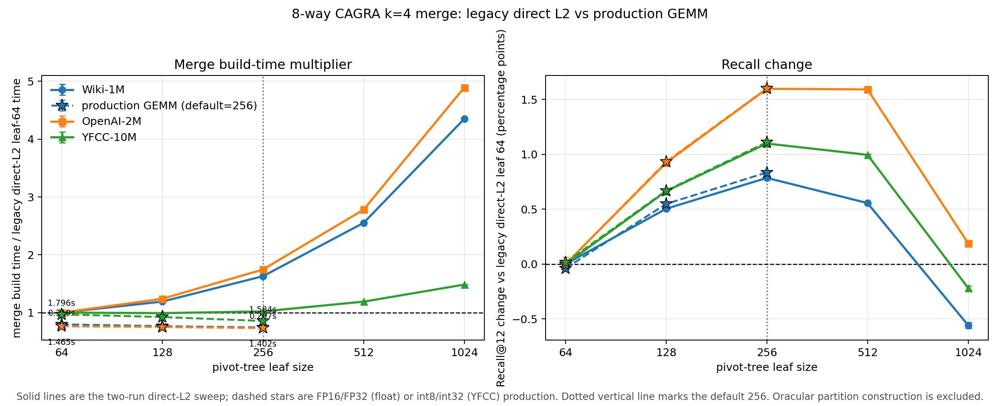
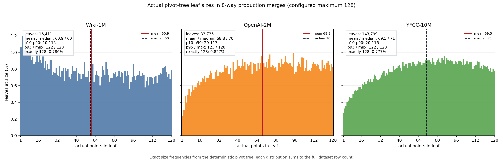
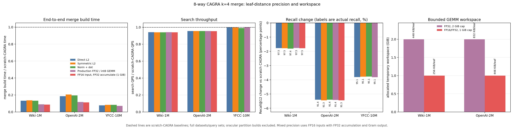
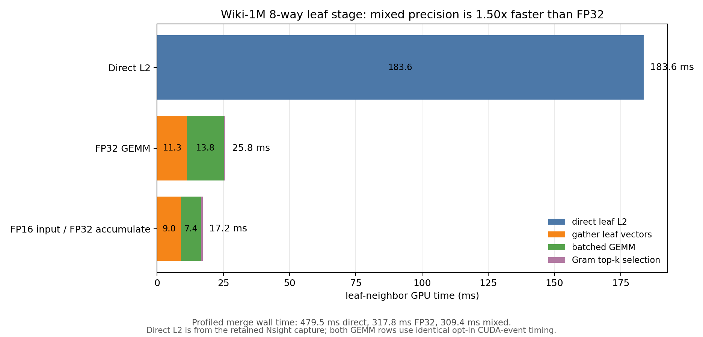
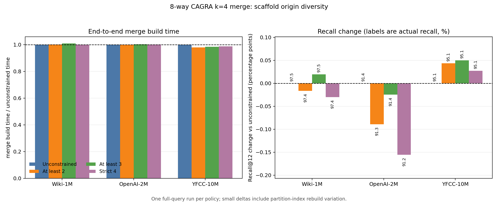

# CAGRA k=4 scaffold merge API

This worktree changes the physical `cuvs::neighbors::cagra::merge()` implementation for eligible
merges. Unfiltered `L2Expanded` merges of at least two attached, uncompressed CAGRA indexes now:

1. concatenate the input datasets on the device;
2. preserve each input graph as a disconnected, offset-adjusted base graph;
3. build one deterministic pivot tree (seed 1234) with leaf size 256;
4. compute each leaf's cross-origin neighbors from a Gram matrix in bounded batches (FP32 GEMM
   for float data and native int8/int32 GEMM for byte data);
5. append those four scaffold neighbors to the base graph;
6. distance-sort the dense graph in place;
7. run the existing CAGRA graph optimizer to the requested `index_params.graph_degree`; and
8. return an index that owns both its aligned dataset and device graph.

The scaffold uses stable binary scatter rather than a global radix sort at every pivot level.
Per-chunk counts preserve the checkpoint's active-first, stable ordering while transferring only
compact count and offset arrays. Pivot distance loops use aligned four-element loads, and the pivot
kernel computes both pivot distances while loading each point once. Leaf vectors are gathered into
at most 2 GiB of temporary batches. Float32 uses standard-precision FP32 Gram matrices. Uint8 is
centered by 128 into int8 (which preserves L2 distance) and multiplied with exact int32 accumulation;
signed int8 uses the same path without centering. There is no float conversion of the byte dataset.
Float16 and integer dimensions unsafe for int32 accumulation retain the direct-L2 leaf kernel.

The optimizer writes directly to its final device matrix. The returned index takes ownership of
that matrix, avoiding optimizer host writeback and the subsequent host-to-device graph copy. The
merge also uses an in-place device sort, avoiding scratch copies of an already-device-resident
dataset and graph.

The rebuild implementation remains the fallback for filters, metrics other than `L2Expanded`
(subject to existing rebuild support), compressed indexes, fewer than two inputs, unsupported
degree combinations, and device allocation failure. The public merge function signature is
unchanged.

## Validation

- Release instantiations compile with warnings-as-errors for float32, float16, int8, and uint8.
- A leaf-64 fixed-input comparison found zero differences across 131,072 float32 and 131,072
  uint8 scaffold entries versus the checkpoint global-sort path.
- Runtime smoke tests at the current leaf-256 default for all four datatypes verify graph bounds,
  cross-origin edges, owned dataset and graph lifetimes, graph-only output, and successful CAGRA
  search. Deterministic 4,096-point checks give identical ordered scaffold hashes for direct L2 and
  the production FP32, uint8, and signed-int8 Gram paths.
- The leaf-64 checkpoint passed the existing float32 and uint8 merge suites. The leaf-64 optimized
  objects additionally pass seven focused upstream cases covering L2 device input, L2 host input,
  and the InnerProduct rebuild fallback.
- All nine leaf-64 dataset/fan-in benchmarks, all 30 legacy leaf-size sweep runs, the 12 new
  production leaf-64/256 runs, and the 8-way distance/origin trials completed with the complete
  query and ground-truth sets.

## Benchmark boundary

`CAGRA_MERGE_API_BENCH` invokes the public `cagra::merge()` call. Input partition indexes are
constructed contiguously in-process so concatenation preserves source IDs. Their construction is
oracular and excluded, as are dataset/query reads and query transfer. `merge_api_e2e_ms` includes
merged-dataset allocation/copy, scaffold construction, base-graph append, distance sort, CAGRA
optimization, and final index attachment.

Search uses CAGRA with k=12, `itopk_size=160`, one warmup, and the median of three repetitions.
Every dataset uses its complete query set and provided ground truth. Measurements were made on an
NVIDIA H100 PCIe 80 GB. Raw retained results are in
[merge_api_results/results.csv](merge_api_results/results.csv); all optimization trials, including
rejected variants, are in
[merge_api_results/optimization_exploration.csv](merge_api_results/optimization_exploration.csv).
The leaf-distance and origin-diversity studies are in
[merge_api_results/leaf_distance_8way.csv](merge_api_results/leaf_distance_8way.csv) and
[merge_api_results/origin_diversity_8way.csv](merge_api_results/origin_diversity_8way.csv).
Production GEMM fan-in reruns are in
[merge_api_results/production_gemm_fanin.csv](merge_api_results/production_gemm_fanin.csv).

## Leaf-64 optimization results versus scratch construction

Parentheses give the optimized leaf-64 k=4 change relative to scratch CAGRA at the same dataset
and fan-in.

| dataset | fan-in | scratch merge | optimized leaf-64 merge | scratch Recall@12 | leaf-64 Recall@12 | scratch QPS | leaf-64 QPS |
| --- | ---: | ---: | ---: | ---: | ---: | ---: | ---: |
| Wiki-1M | 2 | 3.633 s | 0.362 s (10.0x faster) | 0.992233 | 0.990825 (-0.001408) | 71,238 | 68,298 (-4.13%) |
| Wiki-1M | 4 | 3.673 s | 0.389 s (9.44x faster) | 0.992125 | 0.984325 (-0.007800) | 71,137 | 67,664 (-4.88%) |
| Wiki-1M | 8 | 3.567 s | 0.399 s (8.95x faster) | 0.992350 | 0.969192 (-0.023158) | 71,230 | 67,008 (-5.93%) |
| OpenAI-2M | 2 | 12.742 s | 1.730 s (7.37x faster) | 0.967746 | 0.956200 (-0.011546) | 34,357 | 33,431 (-2.70%) |
| OpenAI-2M | 4 | 12.596 s | 1.858 s (6.78x faster) | 0.968196 | 0.939079 (-0.029117) | 34,291 | 33,078 (-3.54%) |
| OpenAI-2M | 8 | 12.719 s | 1.920 s (6.63x faster) | 0.967888 | 0.903054 (-0.064834) | 34,289 | 32,759 (-4.46%) |
| YFCC-10M (uint8) | 2 | 23.759 s | 1.831 s (13.0x faster) | 0.988858 | 0.984067 (-0.004791) | 350,026 | 348,848 (-0.34%) |
| YFCC-10M (uint8) | 4 | 23.616 s | 1.841 s (12.8x faster) | 0.988560 | 0.973110 (-0.015450) | 350,951 | 351,690 (+0.21%) |
| YFCC-10M (uint8) | 8 | 23.681 s | 1.847 s (12.8x faster) | 0.988664 | 0.944563 (-0.044101) | 350,825 | 346,738 (-1.16%) |

## Leaf-64 improvement over the checkpoint

The optimized leaf-64 row gives its actual value; the percentage reduction and recall/QPS
changes are relative to commit `db4260f6`.

| dataset | fan-in | checkpoint merge | optimized leaf-64 merge | checkpoint Recall@12 | leaf-64 Recall@12 | checkpoint QPS | leaf-64 QPS |
| --- | ---: | ---: | ---: | ---: | ---: | ---: | ---: |
| Wiki-1M | 2 | 0.812 s | 0.362 s (-55.35%) | 0.990458 | 0.990825 (+0.000367) | 68,823 | 68,298 (-0.76%) |
| Wiki-1M | 4 | 0.867 s | 0.389 s (-55.13%) | 0.985033 | 0.984325 (-0.000708) | 67,910 | 67,664 (-0.36%) |
| Wiki-1M | 8 | 0.864 s | 0.399 s (-53.87%) | 0.969400 | 0.969192 (-0.000208) | 66,774 | 67,008 (+0.35%) |
| OpenAI-2M | 2 | 2.975 s | 1.730 s (-41.86%) | 0.955571 | 0.956200 (+0.000629) | 33,427 | 33,431 (+0.01%) |
| OpenAI-2M | 4 | 3.151 s | 1.858 s (-41.05%) | 0.938821 | 0.939079 (+0.000258) | 33,049 | 33,078 (+0.09%) |
| OpenAI-2M | 8 | 3.238 s | 1.920 s (-40.72%) | 0.903867 | 0.903054 (-0.000813) | 32,710 | 32,759 (+0.15%) |
| YFCC-10M (uint8) | 2 | 6.892 s | 1.831 s (-73.43%) | 0.984146 | 0.984067 (-0.000079) | 350,068 | 348,848 (-0.35%) |
| YFCC-10M (uint8) | 4 | 6.738 s | 1.841 s (-72.68%) | 0.972943 | 0.973110 (+0.000167) | 346,943 | 351,690 (+1.37%) |
| YFCC-10M (uint8) | 8 | 6.851 s | 1.847 s (-73.04%) | 0.944492 | 0.944563 (+0.000071) | 347,100 | 346,738 (-0.10%) |

Every merge-time result improved. Recall deltas range from -0.000813 to +0.000629 and QPS changes
from -0.76% to +1.37%, consistent with the variation from rebuilding the oracular partition
indexes between runs.

## Optimization exploration

Two-way merge time at each retained stage; all stages use leaf size 64:

| stage | Wiki-1M | OpenAI-2M | YFCC-10M |
| --- | ---: | ---: | ---: |
| fresh checkpoint rerun | 0.822 s | 2.973 s | 6.577 s |
| remove full ID-array host copies | 0.787 s | 2.911 s | 5.311 s |
| replace global sort with stable scatter | 0.736 s | 2.753 s | 3.781 s |
| aligned four-element distance loads | 0.669 s | 2.470 s | 3.428 s |
| fuse both pivot distances | 0.583 s | 2.169 s | 3.420 s |
| device optimizer output and owned graph | 0.377 s | 1.769 s | 1.922 s |
| compact scatter offsets | 0.370 s | 1.761 s | 1.856 s |
| compact uint32 chunk bounds | 0.368 s | 1.758 s | 1.844 s |
| in-place device graph sort | 0.362 s | 1.730 s | 1.831 s |

Rejected experiments:

- RMM/Thrust policy plus reusable chunk storage was 1.5–2.6% slower across all datasets.
- A 20-level pivot cap was faster but reduced Recall@12 by 0.0036–0.0074; 24/32 levels also
  introduced quality uncertainty, so the exact 64-level path remains.
- Native uint8 DP4A increased YFCC time from 3.420 s to 3.471 s.
- Shared pivot caching slowed both float datasets despite a small YFCC improvement.
- 64- and 256-thread pivot launches did not beat 128 threads across all datasets.
- Active-only pivot descriptors were within noise and slightly slower on YFCC.

## Larger-leaf sweep at 8-way fan-in

Eight-way fan-in has the largest recall loss, so the leaf-size experiment prioritizes that case.
The sweep covers leaf sizes 64, 128, 256, 512, and 1024 on all three datasets. Each point is the
arithmetic mean of two independent runs using the complete query and ground-truth sets (10,000
Wiki queries, 20,000 OpenAI queries, and 100,000 YFCC queries). The timing boundary is the same
merge-only `merge_api_e2e_ms` boundary described above; construction of the eight input partition
graphs remains oracular and excluded.

Parentheses give the change from the leaf-64 mean for the same dataset. Actual build time and
Recall@12 are shown first.

| dataset | leaf size | merge build time | Recall@12 |
| --- | ---: | ---: | ---: |
| Wiki-1M | 64 | 0.400 s (baseline) | 0.969054 (baseline) |
| Wiki-1M | 128 | 0.477 s (+19.09%) | 0.974100 (+0.005046) |
| Wiki-1M | 256 | 0.652 s (+62.97%) | 0.976913 (+0.007859) |
| Wiki-1M | 512 | 1.021 s (+155.24%) | 0.974617 (+0.005563) |
| Wiki-1M | 1024 | 1.741 s (+335.07%) | 0.963480 (-0.005574) |
| OpenAI-2M | 64 | 1.917 s (baseline) | 0.904121 (baseline) |
| OpenAI-2M | 128 | 2.375 s (+23.92%) | 0.913361 (+0.009240) |
| OpenAI-2M | 256 | 3.346 s (+74.53%) | 0.920098 (+0.015977) |
| OpenAI-2M | 512 | 5.330 s (+178.06%) | 0.920044 (+0.015923) |
| OpenAI-2M | 1024 | 9.379 s (+389.27%) | 0.906021 (+0.001900) |
| YFCC-10M (uint8) | 64 | 1.851 s (baseline) | 0.944352 (baseline) |
| YFCC-10M (uint8) | 128 | 1.835 s (-0.88%) | 0.950997 (+0.006644) |
| YFCC-10M (uint8) | 256 | 1.890 s (+2.09%) | 0.955341 (+0.010989) |
| YFCC-10M (uint8) | 512 | 2.203 s (+18.98%) | 0.954311 (+0.009959) |
| YFCC-10M (uint8) | 1024 | 2.748 s (+48.44%) | 0.942174 (-0.002178) |

The solid lines and error bars are the retained two-run direct-L2 sweep. Dashed star curves show the
current production path at leaves 64, 128, and 256: FP16 inputs with FP32 accumulation/output for
Wiki/OpenAI and native int8/int32 for YFCC. The new 64 and 256 points are means of two complete-query
runs. The retained leaf-128 point has two float runs and one YFCC run. All values use the same
merge-only boundary, excluding oracular partition construction.

The production table uses each production leaf-64 mean as its baseline. Actual values appear first;
parentheses give the build-time percentage or absolute recall change.

| dataset | leaf 64 build | leaf 128 build | leaf 256 build | leaf 64 Recall@12 | leaf 128 Recall@12 | leaf 256 Recall@12 |
| --- | ---: | ---: | ---: | ---: | ---: | ---: |
| Wiki-1M | 0.319 s (baseline) | 0.306 s (-3.97%) | 0.297 s (-6.75%) | 0.968671 (baseline) | 0.974541 (+0.005870) | 0.977404 (+0.008733) |
| OpenAI-2M | 1.465 s (baseline) | 1.439 s (-1.75%) | 1.402 s (-4.26%) | 0.904088 (baseline) | 0.913450 (+0.009362) | 0.920127 (+0.016039) |
| YFCC-10M (uint8) | 1.796 s (baseline) | 1.710 s (-4.79%) | 1.584 s (-11.79%) | 0.944493 (baseline) | 0.951047 (+0.006554) | 0.955469 (+0.010976) |

The production result reverses the direct-L2 build-time trend through leaf 256: leaf 256 is both
faster and higher-recall than leaf 128 on all three datasets. The likely reason is that fixed-size
GEMMs exploit the larger matrices efficiently while the pivot tree emits fewer leaves and levels;
the direct kernel instead pays the larger per-point candidate scan without the same GEMM efficiency.
The retained direct-L2 topology results warn against extrapolating past 256: recall reverses by
512/1024 while direct work rises sharply. Production GEMM at 512/1024 was not rerun. Leaf 256 is now
the checked-in production default because it is faster and higher-recall than leaf 128 on all three
production paths measured here.

Raw legacy measurements are in
[merge_api_results/leaf_size_8way.csv](merge_api_results/leaf_size_8way.csv). New and retained
production runs are in
[merge_api_results/leaf_size_production_8way.csv](merge_api_results/leaf_size_production_8way.csv),
with means in
[merge_api_results/leaf_size_production_summary.csv](merge_api_results/leaf_size_production_summary.csv).
The figure is reproducible with [plot_k4_leaf_size.py](plot_k4_leaf_size.py).

### Actual leaf-size distributions

This retained distribution experiment used a configured maximum of 128, but the deterministic
pivot tree rarely emitted a full leaf. Exact size frequencies were captured from the 8-way tree on
every dataset; the counts sum to the complete dataset row count. The production default is now 256,
so these histograms describe the earlier leaf-128 configuration rather than the new default.

| dataset | rows | leaves | mean | median | p10-p90 | p95 | max | exactly 128 |
| --- | ---: | ---: | ---: | ---: | ---: | ---: | ---: | ---: |
| Wiki-1M | 1,000,000 | 16,411 | 60.9 | 60 | 10-115 | 122 | 128 | 0.786% |
| OpenAI-2M | 2,321,096 | 33,736 | 68.8 | 70 | 20-117 | 123 | 128 | 0.827% |
| YFCC-10M | 10,000,000 | 143,799 | 69.5 | 71 | 20-116 | 122 | 128 | 0.777% |

Padding every leaf to 128 therefore represents 2.10x the actual Wiki point count, 1.86x OpenAI,
and 1.84x YFCC. This explains why workspace in that experiment was governed by the configured
maximum rather than the mean leaf size. Exact counts and statistics are in
[merge_api_results/leaf_size_histogram_8way.csv](merge_api_results/leaf_size_histogram_8way.csv)
and
[merge_api_results/leaf_size_distribution_summary.csv](merge_api_results/leaf_size_distribution_summary.csv);
the figure is reproducible with
[plot_k4_leaf_distribution.py](plot_k4_leaf_distribution.py).

## Leaf-distance matrix study at 8-way fan-in

The leaf-128 kernel previously evaluated every directed candidate independently, so each
cross-origin unordered pair was loaded and evaluated twice. Four baseline alternatives were run at 8-way fan-in on every dataset, plus a fifth
float-only mixed-precision variant:

- **Direct L2:** the committed control, one thread per point.
- **Symmetric L2:** compute each unordered pair once into the 8,128-entry triangular shared-memory
  matrix, then scan that matrix from both endpoints.
- **Norm + dot:** use `||x-y||² = xᵀx + yᵀy - 2xᵀy` in the same symmetric matrix. The YFCC path
  uses native uint8 DP4A dot products rather than converting the dataset to float.
- **Batched GEMM:** gather leaf vectors, form full 128×128 Gram matrices with cuBLAS, then run a
  small top-k selection kernel. Float uses standard FP32 compute. Uint8 is centered into int8 and
  accumulated exactly into int32.
- **Mixed FP16/FP32 GEMM (float only):** quantize gathered float vectors to FP16, multiply with
  FP32 accumulation and FP32 Gram output, then use the same float top-k kernel. The 1 GiB variant
  deliberately halves the bounded allocation relative to production FP32.

The table below uses the exact production-object run and its contemporaneous direct-L2 control.
Each optimized cell gives its actual value first and its change from direct L2 in parentheses.
Partition graph construction remains oracular and excluded from build time.

| dataset | direct-L2 merge | production GEMM merge | direct Recall@12 | GEMM Recall@12 | direct QPS | GEMM QPS |
| --- | ---: | ---: | ---: | ---: | ---: | ---: |
| Wiki-1M | 0.475 s | 0.320 s (-32.51%) | 0.974633 | 0.974675 (+0.000042) | 67,044 | 67,094 (+0.07%) |
| OpenAI-2M | 2.371 s | 1.483 s (-37.46%) | 0.913892 | 0.913754 (-0.000138) | 32,758 | 32,749 (-0.03%) |
| YFCC-10M (uint8) | 1.838 s | 1.697 s (-7.67%) | 0.950550 | 0.950523 (-0.000027) | 350,667 | 351,425 (+0.22%) |

The rejected custom-kernel results explain why symmetry alone is insufficient. Actual values are
shown first; parentheses are changes from the direct-L2 row for that dataset.

| dataset | leaf-distance method | merge build time | Recall@12 |
| --- | --- | ---: | ---: |
| Wiki-1M | direct L2 | 0.475 s (baseline) | 0.974633 (baseline) |
| Wiki-1M | symmetric L2 | 0.488 s (+2.89%) | 0.974525 (-0.000108) |
| Wiki-1M | symmetric norm + dot | 0.475 s (+0.05%) | 0.974258 (-0.000375) |
| Wiki-1M | production FP32 GEMM | 0.320 s (-32.51%) | 0.974675 (+0.000042) |
| OpenAI-2M | direct L2 | 2.371 s (baseline) | 0.913892 (baseline) |
| OpenAI-2M | symmetric L2 | 2.617 s (+10.40%) | 0.913442 (-0.000450) |
| OpenAI-2M | symmetric norm + dot | 2.476 s (+4.44%) | 0.913925 (+0.000033) |
| OpenAI-2M | production FP32 GEMM | 1.483 s (-37.46%) | 0.913754 (-0.000138) |
| YFCC-10M (uint8) | direct L2 | 1.838 s (baseline) | 0.950550 (baseline) |
| YFCC-10M (uint8) | symmetric L2 | 1.971 s (+7.24%) | 0.950825 (+0.000275) |
| YFCC-10M (uint8) | symmetric norm + DP4A dot | 1.986 s (+8.03%) | 0.950912 (+0.000362) |
| YFCC-10M (uint8) | production int8/int32 GEMM | 1.697 s (-7.67%) | 0.950523 (-0.000027) |

Following the report's plotting convention, the figure uses scratch CAGRA construction as the
build-time, QPS, and recall baseline; the tables above use direct L2 to isolate the leaf-kernel
change. The red float-only bars are the mean of two mixed-precision 1 GiB runs. The fourth panel
shows the actual bounded allocation and labels the padded bytes required per leaf.

The symmetric kernels halve distance evaluations, but their 32 KiB triangular matrix lowers
occupancy and adds a matrix write plus a second scan. They therefore range from neutral to 10.40%
slower. GEMM computes both matrix triangles—more arithmetic than the symmetric kernel—but executes
that arithmetic far more efficiently. A standard-FP32 deterministic check matched the direct-L2
ordered scaffold hash. Fast TF32 was another 2.2–2.7% faster on the two float datasets, but changed
the deterministic graph hash, so it was not retained.

The first prototype allocated every padded leaf at once. Leaves are not packed to exactly 128
points: the Wiki profile produced 16,411 leaves, so that prototype needed 7.53 GB of temporary leaf
vectors plus Gram matrices on Wiki alone and scaled still higher on the larger datasets. Production
instead processes leaf batches with a 2 GiB aggregate cap. The cap had no measured penalty: the
2 GiB trials were 0.323 s, 1.483 s, and 1.677 s, versus 0.321 s, 1.512 s, and 1.687 s for the
unbounded trials. A 512 MiB alternative was only 1.0% slower than 2 GiB on OpenAI and 0.7% slower
on YFCC, but 2 GiB is retained for the larger GEMM batches.

### Half-precision float GEMM experiment

The robust half-precision variant stores gathered vectors in FP16 but retains FP32 accumulation and
FP32 Gram output. This retained precision experiment used leaf size 128; the production leaf default
is now 256. Keeping the Gram output in FP32 avoids the cancellation and range loss of storing dot
products in FP16.
Each value below is an actual mean; parentheses compare to the contemporaneous FP32 control for the
same dataset.

| dataset | FP32, 2 GiB | mixed, 2 GiB | mixed, 1 GiB | 1 GiB Recall@12 | 1 GiB QPS |
| --- | ---: | ---: | ---: | ---: | ---: |
| Wiki-1M | 0.319 s | 0.304 s (-4.51%) | 0.306 s (-3.81%) | 0.974541 (+0.000057) | 67,019 (-0.19%) |
| OpenAI-2M | 1.485 s | 1.421 s (-4.28%) | 1.439 s (-3.08%) | 0.913450 (+0.000188) | 32,738 (-0.04%) |

The storage reduction is material even with FP32 output:

| dataset | FP32 bytes / padded leaf | mixed bytes / padded leaf | per-leaf reduction | FP32 allocation | mixed allocation |
| --- | ---: | ---: | ---: | ---: | ---: |
| Wiki-1M | 448 KiB | 256 KiB | 42.86% | 2.000 GiB | 1.000 GiB |
| OpenAI-2M | 832 KiB | 448 KiB | 46.15% | 2.000 GiB | 1.000 GiB |

The 1 GiB path needs five instead of four Wiki batches and 15 instead of 14 OpenAI batches, yet is
still 3.1-3.8% faster end to end. Keeping a 2 GiB cap extracts another 0.7% on Wiki and 1.2% on
OpenAI, so the results expose a clean speed-versus-peak-memory choice.

A maximum-savings Wiki probe also stored the Gram matrix in FP16. It built in 0.372 s, 16.71% slower
than FP32, and reached 0.974150 Recall@12 (-0.000334). That path is rejected. The mixed path remains
compile-time opt-in rather than the production default because FP16 input quantization can change
the scaffold graph even though full-query recall was neutral in these runs. Define
`CUVS_CAGRA_MERGE_FLOAT_GEMM_FP16_INPUT` to enable it; the optional
`CUVS_CAGRA_MERGE_LEAF_GEMM_WORKSPACE_BYTES` definition selects the byte cap, and
`CUVS_CAGRA_MERGE_LEAF_SIZE` supports isolated leaf-size builds around the production default of 256.
Raw repeated measurements and workspace accounting are in
[merge_api_results/leaf_gemm_precision_8way.csv](merge_api_results/leaf_gemm_precision_8way.csv)
and
[merge_api_results/leaf_gemm_precision_summary.csv](merge_api_results/leaf_gemm_precision_summary.csv).

### Leaf-stage profile

The retained direct-L2 row comes from the earlier Nsight Systems capture. The installed Nsight 2022
importer cannot decode the current CUDA 13 driver trace, so the refreshed FP32-versus-mixed rows use
the same opt-in CUDA-event boundaries around gather, GEMM, and top-k. This gives a direct
precision comparison without inferring stage time from the end-to-end wall clock.

| implementation | gather | distance/Gram matrix | top-k selection | total leaf GPU time |
| --- | ---: | ---: | ---: | ---: |
| direct L2 (retained Nsight) | - | 183.625 ms | included | 183.625 ms |
| FP32 GEMM (CUDA events) | 11.319 ms | 13.792 ms | 0.647 ms | 25.758 ms |
| FP16 input / FP32 accumulate (CUDA events) | 9.044 ms | 7.445 ms | 0.719 ms | 17.207 ms |

Mixed precision reduces the identically measured leaf stage by 33.2% (1.50x) relative to FP32.
The GEMM itself is 1.85x faster and the smaller gather output is 1.25x faster; top-k is effectively
unchanged. Profiled merge wall time was 317.759 ms for FP32 and 309.425 ms for the 1 GiB mixed path.
The direct-L2 retained profile was 479.488 ms.

Raw curated profile values are in
[merge_api_results/leaf_distance_profile_8way_wiki.csv](merge_api_results/leaf_distance_profile_8way_wiki.csv).
The refreshed distance and profile plots are reproducible with
[plot_k4_leaf_distance.py](plot_k4_leaf_distance.py) using `--skip-origin`; that flag deliberately
leaves the diversity figures untouched.

## Origin-diverse scaffold neighbors

The strict 8-way policy first selects the nearest representative from each of the four closest
foreign origins. If fewer than four foreign origins occur in the leaf, it selects one from every
available origin and fills the remaining slots by unconstrained distance. A one-pass implementation
tracks the nearest representative per retained origin plus the four unconstrained nearest points,
so it performs the same number of L2 evaluations as the control. A symmetric-matrix cross-check
produced the same per-row neighbor sets. Two natural softer variants require only two or three
origins before filling by distance.

Actual constrained values are shown first; parentheses give the change from the unconstrained run
for that dataset. These are one full-query run per policy, so small changes include variation from
rebuilding the oracular partition indexes.

| dataset | origin policy | merge build time | Recall@12 |
| --- | --- | ---: | ---: |
| Wiki-1M | unconstrained | 0.475 s (baseline) | 0.974633 (baseline) |
| Wiki-1M | at least 2 origins | 0.475 s (+0.12%) | 0.974467 (-0.000166) |
| Wiki-1M | at least 3 origins | 0.479 s (+0.85%) | 0.974825 (+0.000192) |
| Wiki-1M | strict 4 origins | 0.474 s (-0.09%) | 0.974333 (-0.000300) |
| OpenAI-2M | unconstrained | 2.371 s (baseline) | 0.913892 (baseline) |
| OpenAI-2M | at least 2 origins | 2.368 s (-0.11%) | 0.913000 (-0.000892) |
| OpenAI-2M | at least 3 origins | 2.377 s (+0.27%) | 0.913646 (-0.000246) |
| OpenAI-2M | strict 4 origins | 2.373 s (+0.10%) | 0.912338 (-0.001554) |
| YFCC-10M (uint8) | unconstrained | 1.838 s (baseline) | 0.950550 (baseline) |
| YFCC-10M (uint8) | at least 2 origins | 1.800 s (-2.09%) | 0.950986 (+0.000436) |
| YFCC-10M (uint8) | at least 3 origins | 1.809 s (-1.60%) | 0.951049 (+0.000499) |
| YFCC-10M (uint8) | strict 4 origins | 1.815 s (-1.26%) | 0.950823 (+0.000273) |

The policy has no consistent build-time effect beyond run variation. Quality is mixed: all three
constraints improve the single YFCC run, Wiki is effectively flat, and strict diversity costs
0.001554 Recall@12 on OpenAI. The three-origin alternative reduces that OpenAI loss but does not
show a cross-dataset advantage over the unconstrained rule. No origin constraint is enabled in
production. Raw rows are in
[merge_api_results/origin_diversity_8way.csv](merge_api_results/origin_diversity_8way.csv).

## Earlier leaf-64 optimization profile

The final leaf-64 two-way Wiki capture measures 368.887 ms profiled versus 855.152 ms at the
leaf-64 checkpoint. The ordinary leaf-64 benchmark improves from 811.624 ms to 362.392 ms
(2.24x).

| item | checkpoint | optimized |
| --- | ---: | ---: |
| pivot assignment kernels | 195.174 ms | 63.479 ms |
| leaf cross-origin k-NN | 56.405 ms | 42.194 ms |
| distance sort | 103.708 ms | 104.138 ms |
| CAGRA optimize NVTX range | 312.464 ms | 111.255 ms |
| `cudaFree` API time | 199.656 ms | 3.294 ms |
| device-to-host data | 912.000 MB | 4.051 MB |
| host-to-device data | 800.668 MB | 32.668 MB |
| device-to-device data | 6,688.000 MB | 3,107.157 MB |

The remaining dominant kernels are distance sort (104.138 ms), optimizer pruning (93.929 ms),
pivot assignment (63.479 ms), and leaf k-NN (42.194 ms). See the
[profile report](merge_api_results/nsys/README.md), the
[checkpoint capture](merge_api_results/nsys/wiki1m_2way_k4_2026.nsys-rep), and the
[optimized capture](merge_api_results/nsys/wiki1m_2way_k4_optimized.nsys-rep).
