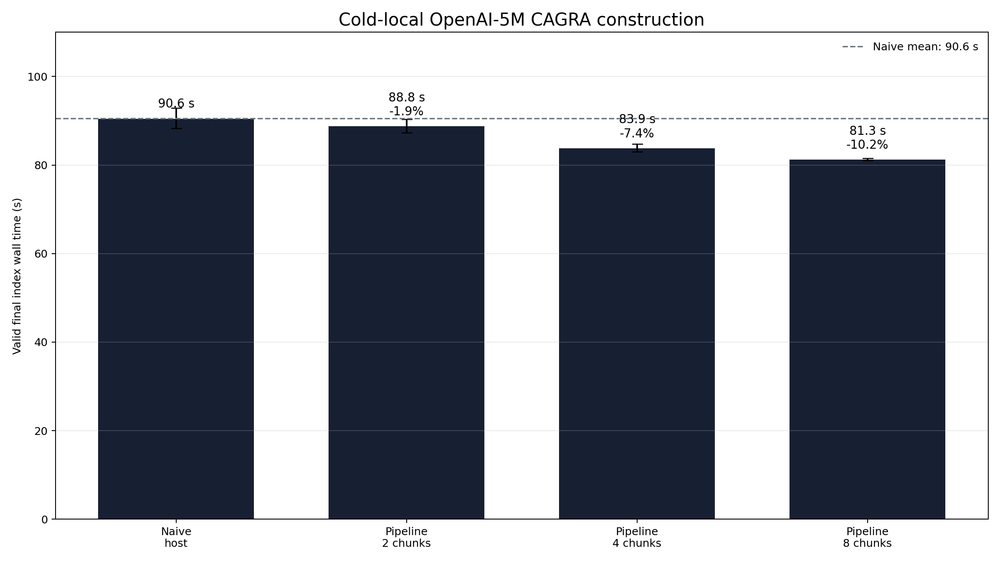
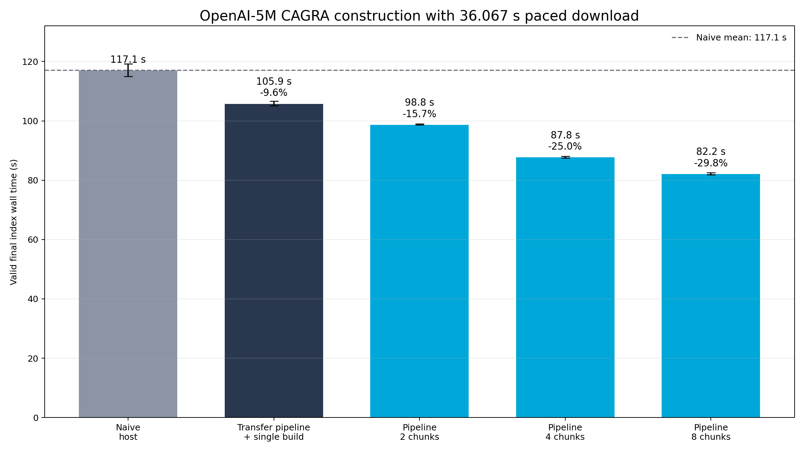
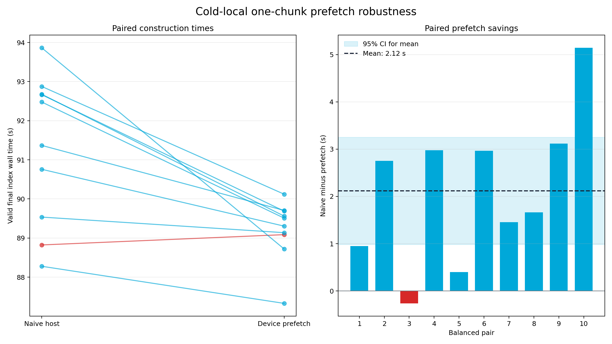
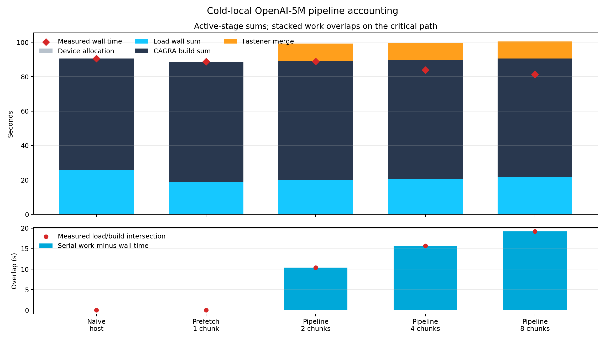
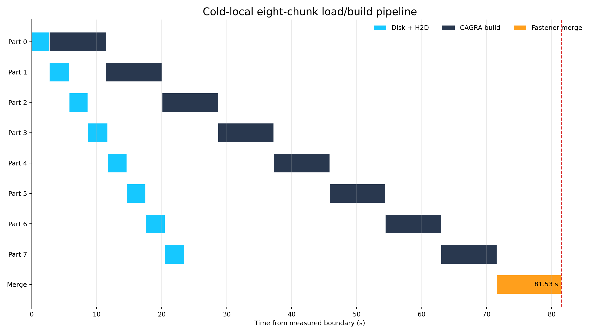
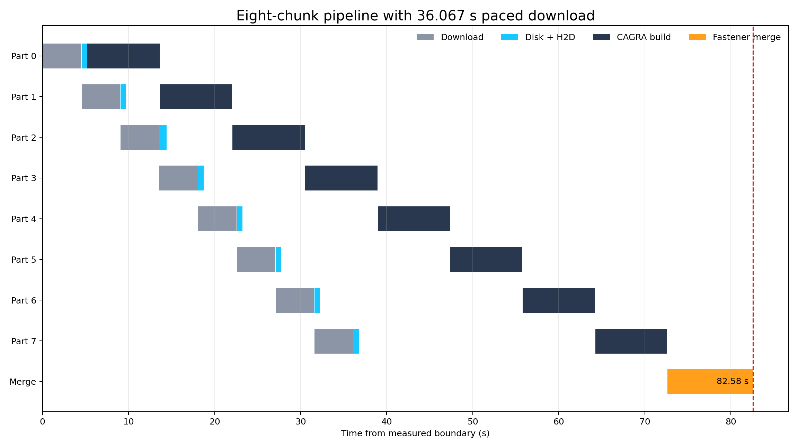
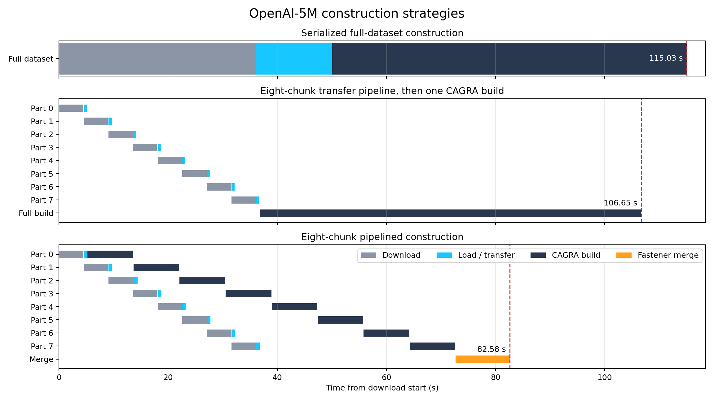

# OpenAI-5M streaming CAGRA construction

This experiment measures whether OpenAI-5M CAGRA construction becomes faster when the dataset is
split into 1, 2, 4, or 8 chunks and disk read, pinned host-to-device transfer, CAGRA construction,
and the final Fastener merge are pipelined. It covers construction only: no queries, ground truth,
search, or recall measurements are part of this study. A separate eight-chunk baseline overlaps
download and H2D but waits to run one full-dataset CAGRA build, isolating build overlap from
transfer overlap.

Eight chunks is the best requested fan-in in both environments. For cold local files it builds a
validated final index in 81.305 s, 9.272 s or 10.2% less wall time than the true naive baseline.
With a 36.067 s paced download it takes 82.184 s, 34.942 s or 29.8% less than naive. The network
gain is larger because the eight-way pipeline overlaps 30.933 s of download with CAGRA builds.

## End-to-end result

Each point is the arithmetic mean of two runs. Brackets contain the complete two-run range, not a
confidence interval. The timer starts at the local allocation/load boundary or at the simulated
network download boundary and stops only after the final device index is synchronized and
validated.

| input mode | construction path | chunks | valid final index | reduction vs naive |
| --- | --- | ---: | ---: | ---: |
| cold local | naive pageable host | 1 | 90.576 s [88.278, 92.875] | baseline |
| cold local | device prefetch | 1 | 88.725 s [87.329, 90.121] | 2.0% |
| cold local | pipelined + Fastener | 2 | 88.831 s [87.286, 90.377] | 1.9% |
| cold local | pipelined + Fastener | 4 | 83.876 s [83.014, 84.739] | 7.4% |
| cold local | pipelined + Fastener | 8 | **81.305 s [81.080, 81.530]** | **10.2%** |
| paced network | naive pageable host | 1 | 117.126 s [115.032, 119.220] | baseline |
| paced network | device prefetch | 1 | 110.266 s [110.191, 110.341] | 5.9% |
| paced network | 8-chunk transfer pipeline + single build | 8 | 105.878 s [105.104, 106.651] | 9.6% |
| paced network | pipelined + Fastener | 2 | 98.780 s [98.609, 98.952] | 15.7% |
| paced network | pipelined + Fastener | 4 | 87.787 s [87.456, 88.117] | 25.0% |
| paced network | pipelined + Fastener | 8 | **82.184 s [81.787, 82.580]** | **29.8%** |





The one-chunk device path separates data movement improvements from splitting. It saves only
1.852 s locally and 6.860 s under the network model. Relative to that stronger control, eight
chunks saves 7.420 s (8.4%) locally and 28.083 s (25.5%) with paced download. The eight-chunk
transfer-only baseline takes 105.878 s: 11.248 s (9.6%) faster than naive, but 23.694 s slower
than the fully pipelined eight-chunk path.

### One-chunk robustness

The original 1.852 s local difference was based on two runs. Eight additional pairs were fixed in
advance, producing 10 pairs total. Each pair ran naive and prefetch back-to-back, with naive first
on odd pair IDs and prefetch first on even IDs to balance period effects.

| statistic | result |
| --- | ---: |
| naive host | 91.332 s mean, 1.911 s SD |
| device prefetch | 89.216 s mean, 0.769 s SD |
| paired savings | **2.116 s (2.32%)** |
| 95% CI for mean savings | **0.981–3.251 s** |
| paired t-test | **t(9)=4.217, two-sided p=0.00225** |
| standardized paired effect | Cohen's dz=1.333 |
| exact Wilcoxon signed-rank | W=1, two-sided p=0.00391 |
| direction | prefetch faster in 9 of 10 pairs |
Using only the eight newly collected pairs gives a 2.182 s mean saving with 95% CI
0.739–3.625 s, t(7)=3.575 and two-sided p=0.00903. The exact Wilcoxon p-value is 0.0156,
with prefetch faster in 7 of 8 new pairs. The follow-up data therefore independently confirm the
direction and approximate magnitude rather than obtaining significance only by reusing the two
original observations.


The 2.116 s mean is statistically distinguishable from zero under the paired t-test assumptions,
and the exact signed-rank result reaches the same conclusion without a normality assumption. The
mechanism remains a larger data-path improvement offset by a slower device-input build:

| 10-pair component mean | naive host | device prefetch | naive minus prefetch |
| --- | ---: | ---: | ---: |
| active disk read | 14.067 s | 15.595 s | -1.528 s |
| load wall time | 26.082 s | 18.732 s | **+7.350 s** |
| CAGRA build interval | 65.249 s | 70.481 s | **-5.232 s** |
| end-to-end | 91.332 s | 89.216 s | **+2.116 s** |

There is a measurable order diagnostic: naive-first pairs average 1.131 s savings, while
prefetch-first pairs average 3.101 s (exploratory Welch p=0.040). This is consistent with a generic
second-run slowdown changing the within-pair contrast. Alternating order keeps the overall
treatment estimate balanced, but the order sensitivity is a reason to report the confidence
interval rather than treating 2.116 s as an exact constant.




Splitting is not automatically a win. Two cold-local chunks are 0.107 s slower than one-chunk
prefetch because 10.413 s of hidden load/build work is consumed by the 9.990 s merge and minor
build variation. Four and eight chunks expose enough overlap to pay for that fixed merge. Under
paced download, even two chunks win because construction can begin after roughly half the file has
arrived. Eight is the best of the requested fan-ins; this experiment does not establish whether
more than eight would improve further.

## Where the time goes

The following values are two-run means for the consistent device-prefetch paths. Load is the sum
of each chunk's wall interval; build is the sum of the CAGRA build intervals. These active-stage
sums deliberately exceed the critical path when work overlaps. "Hidden" is serial work
(allocation + download + load + build + merge) minus measured wall time.

| mode | chunks | download | load sum | build sum | Fastener merge | hidden by overlap | total |
| --- | ---: | ---: | ---: | ---: | ---: | ---: | ---: |
| cold local | 1 | — | 18.828 s | 69.894 s | — | -0.001 s | 88.725 s |
| cold local | 2 | — | 20.099 s | 69.154 s | 9.990 s | 10.413 s | 88.831 s |
| cold local | 4 | — | 20.768 s | 68.819 s | 9.986 s | 15.700 s | 83.876 s |
| cold local | 8 | — | 21.799 s | 68.731 s | 9.979 s | 19.207 s | 81.305 s |
| paced network | 1 | 36.067 s | 4.995 s | 69.204 s | — | 0.001 s | 110.266 s |
| paced network, 8-chunk transfer + single build | 8 | 36.067 s | 5.290 s | 69.156 s | — | 4.637 s | 105.878 s |
| paced network | 2 | 36.068 s | 5.275 s | 68.173 s | 9.995 s | 20.733 s | 98.780 s |
| paced network | 4 | 36.067 s | 5.643 s | 67.537 s | 9.983 s | 31.445 s | 87.787 s |
| paced network | 8 | 36.067 s | 5.464 s | 67.087 s | 9.962 s | 36.399 s | 82.184 s |



The CAGRA build sum remains close to 67–70 s across the device paths. The transfer-only baseline
has no merge; each fully pipelined multi-part run adds about 10 s for Fastener. The speedup therefore comes primarily from scheduling:

- locally, measured load/build intersection rises from 10.413 s at two chunks to 19.208 s at
  eight chunks;
- at eight network chunks, download/build intersection is 30.933 s, load/build intersection is
  4.838 s, and download/load intersection is 4.793 s;
- the first network build begins after about 4.5 s at eight chunks, instead of waiting 36.067 s
  for the whole dataset;
- the transfer-only baseline hides 4.637 s by overlapping download with H2D, but has zero
  download/build overlap; fully pipelining construction saves another 23.694 s despite its
  9.962 s merge.

The network eight-way mean is only 0.879 s slower than cold-local eight-way despite including a
36.067 s transfer. This is not a storage-speed comparison: local inputs are explicitly cold, while
freshly downloaded files remain in the normal Linux page cache. It demonstrates that almost all
of the modeled transfer can leave the construction critical path.







The separate pipeline diagrams use the same representative retained trace without embedding a run
identifier in their titles. The comparison places serialized construction, eight-chunk transfer followed by one full build,
and the eight-chunk construction pipeline on the same scale. Per-part intervals are recorded
directly. Each plot
positions the recorded merge duration so it ends at the end-to-end time; subsequent validity
bookkeeping is below the visible resolution.

## Paths compared

### True naive baseline

The `naive-host` path waits for its one complete input file, deserializes the full fbin payload into
a pageable `std::vector<float>`, and passes a host matrix view to `cagra::build`. Its
`cagra::index_params` object is untouched. The library therefore owns any internal transfer and
attachment behavior. The output must own a 5,000,000-row device dataset and graph before the timer
stops.

The naive component's build interval includes work internal to the host-input library path, so its
build sub-timing should not be compared directly with the explicitly instrumented H2D and
device-input build intervals. Its end-to-end time is the intended comparison.

### Transfer pipeline with one full build

The `prefetch-single-build` path is a network-only eight-chunk control. It allocates one contiguous
5,000,000 x 1,536 device matrix, loads each completed part directly into its final row range through
the same pinned-buffer H2D engine, and starts no CAGRA work until all eight parts are resident. It
then runs one device-input `cagra::build` with default graph parameters, attaches the
already-prefetched matrix without another dataset copy, and performs no Fastener merge. Its zero
download/build overlap distinguishes the benefit of transfer pipelining from the additional
benefit of construction pipelining.

### Device-prefetch pipeline

The `prefetch-device` path:

1. preallocates every final chunk-sized device matrix after the timer starts;
2. reads each complete part through two 64 MiB pinned buffers;
3. uses a nonblocking CUDA stream and events to overlap disk reads with H2D copies;
4. lets later chunk loads proceed on a loader thread while the main thread builds the current
   CAGRA index;
5. constructs with default `cagra::index_params` except
   `attach_dataset_on_build=false`, then transfers ownership of the already-prefetched device
   matrix into that index without another dataset copy; and
6. for 2/4/8 chunks, performs one final Fastener merge with untouched default merge parameters.

The default graph degree remains 64 and the default intermediate graph degree remains 128 in every
row. Multi-part runs refuse to start unless CUDA VMM is supported and RMM uses a direct
`cuda_memory_resource`. The inputs are eligible owning device indexes, so Fastener can incrementally
construct the final contiguous dataset at its permanent virtual address. There is no host merge or
host-staging fallback in this path; the implementation's compatibility fallback is the prior
direct device-to-device two-copy consolidation.

## Dataset, system, and timer boundaries

| item | value |
| --- | --- |
| dataset | `/raid/blandrum/openai_5m/base.5M.fbin` |
| shape/type | 5,000,000 x 1,536 float32 |
| payload | 30,720,000,000 bytes (28.610 GiB) |
| GPU | NVIDIA H100 PCIe, 81,559 MiB |
| driver / CUDA compiler | 580.126.20 / CUDA 13.2 (V13.2.78) |
| CPU / host RAM | Arm Neoverse-N1 / 250 GiB |
| kernel | Linux 6.8.0-101-generic aarch64 |
| source base | `5c4cb166d4d13e27fb4fc98c8483ec77bceb76df` |
| repeats | two per retained configuration |

For local mode, one split set is first materialized under
`/raid/blandrum/cuvs-streaming-openai5m-tmp`, `fdatasync` is applied, and the files are advised out
of the page cache. Configuration-mean preparation ranges from 50.1 to 63.7 s; individual runs range
from 45.9 to 66.1 s. It is recorded as `prepare_ms_excluded` and remains outside the benchmark
boundary. Timing then covers device allocation, cold disk reads, H2D, builds, merge, synchronization,
and final validation.

For network mode, the source payload is preloaded into host RAM outside the timer (25.5–27.2 s) so
reading the source from the same NVMe device cannot throttle the simulated incoming connection.
The timed writer creates real per-part fbin files under `/raid`, pacing cumulative payload bytes
to 36.067 s. A part becomes loadable only when its complete file has arrived. The network path uses
ordinary buffered-write semantics: it does not force `fdatasync` or evict a freshly written file
before consuming it. Timing covers paced writes, reads, H2D, builds, merge, synchronization, and
validation.

The temporary-directory guard accepts only paths below `/raid/blandrum/`, requires its private
marker before removing a pre-existing directory, checks that one payload plus 2 GiB of headroom is
available, and removes the directory on every exit. Only one approximately 30.72 GB split set
exists at once. The directory was verified absent after every retained run and after the final
matrix.

## Download-rate interpretation

The supplied representative download reported 36.067 s wall time and 878.4 MiB/s. Those numbers
cannot both describe this exact 30,720,000,000-byte payload:

`30,720,000,000 / 2^20 / 36.067 = 812.29 MiB/s`.

The experiment treats the observed 36.067 s wall time as authoritative and paces to it. Definitive
runs completed in 36.0671–36.0698 s, corresponding to 812.23–812.29 MiB/s. The 878.4 MiB/s log
likely used a different byte or interval accounting convention; it is not used to shorten the
simulation.

Three methodology pilots were rejected before the definitive matrix:

- reading the source and writing the destination on the same NVMe device stretched the transfer
  to 57.95 s because the simulator contended with itself;
- preloading from RAM but synchronizing each part stretched it to 40.39 s;
- evicting fresh dirty output pages after each network read introduced writeback artifacts and
  inflated per-part load time.

Those pilot rows were removed from the retained raw CSVs. The final model uses excluded RAM preload,
exact cumulative pacing, real buffered part files, and no network-mode cache eviction.

## Validation and artifacts

The fan-in analysis rejects missing or duplicate configurations, wrong dataset shape, non-default
graph degrees, a paced transfer more than 20 ms from target, malformed per-part layout, or any
invalid final index. It validates 22 summary rows and 80 per-part rows. The paired analysis
separately requires complete local naive/prefetch pairs numbered 1–10 and incorporates the 16
additional valid rows from the robustness run.

Every run checks that the final index:

- has 5,000,000 rows and dimension 1,536;
- has graph degree 64 and a 5,000,000-row device graph;
- has an attached 5,000,000 x 1,536 dataset; and
- owns its final graph and dataset allocations.

Retained artifacts:

- [raw run summary](merge_api_results/streaming_openai5m_summary_20260709.csv)
- [raw per-part timeline](merge_api_results/streaming_openai5m_parts_20260709.csv)
- [derived aggregate table](merge_api_results/streaming_openai5m_aggregated_20260709.csv)
- [analysis and plotting script](plot_streaming_openai5m.py)
- [one-chunk robustness raw summary](merge_api_results/streaming_openai5m_onechunk_robustness_summary_20260709.csv)
- [one-chunk robustness per-part rows](merge_api_results/streaming_openai5m_onechunk_robustness_parts_20260709.csv)
- [derived paired observations](merge_api_results/streaming_openai5m_onechunk_pairs_20260709.csv)
- [derived paired statistics](merge_api_results/streaming_openai5m_onechunk_statistics_20260709.csv)
- [paired statistical analysis](analyze_streaming_openai5m_onechunk.py)

The retained artifact set is CSV, PNG, Python, CUDA/C++, CMake, and Markdown only. It contains no
SQLite database, profiler database, environment dump, or captured environment variables.

To regenerate the aggregate and plots:

```bash
python3 experiments/cpp/plot_streaming_openai5m.py
python3 experiments/cpp/analyze_streaming_openai5m_onechunk.py
```

The benchmark is available as the CMake target `CAGRA_STREAMING_BUILD_BENCH`. Representative fully
pipelined and transfer-only baseline invocations are:

```bash
CAGRA_STREAMING_BUILD_BENCH \
  --dataset /raid/blandrum/openai_5m/base.5M.fbin \
  --temp-dir /raid/blandrum/cuvs-streaming-openai5m-tmp \
  --summary-csv experiments/cpp/merge_api_results/streaming_openai5m_summary.csv \
  --parts-csv experiments/cpp/merge_api_results/streaming_openai5m_parts.csv \
  --mode network --build-path prefetch-device --parts 8 --run 1 \
  --network-seconds 36.067 --io-chunk-mib 64

CAGRA_STREAMING_BUILD_BENCH \
  --dataset /raid/blandrum/openai_5m/base.5M.fbin \
  --temp-dir /raid/blandrum/cuvs-streaming-openai5m-tmp \
  --summary-csv experiments/cpp/merge_api_results/streaming_openai5m_summary.csv \
  --parts-csv experiments/cpp/merge_api_results/streaming_openai5m_parts.csv \
  --mode network --build-path prefetch-single-build --parts 8 --run 1 \
  --network-seconds 36.067 --io-chunk-mib 64
```

## Limitations

- The 2/4/8-chunk fan-in points and transfer-only baseline have only two runs each, enough to
  establish the large trend
  but not enough for formal variance estimates.
- The local one-chunk comparison has 10 balanced pairs and formal paired inference, but its
  exploratory order effect shows sensitivity to short-term system state.
- The network is a paced local simulator, not an actual remote transfer; it omits network jitter,
  protocol overhead, and competing workloads. Its excluded 30.72 GB RAM preload is simulator
  apparatus, not part of a deployable data path.
- Fresh network files are page-cache hot, whereas local files are deliberately cold. The two modes
  answer different questions and should not be read as a storage benchmark.
- Only one H100 PCIe system was measured. Storage, NUMA placement, GPU interconnect, and available
  host memory can change the crossover.
- Default CAGRA graph parameters are fixed, but its internal build heuristic may select work based
  on each chunk's shape. This study reports the resulting end-to-end default behavior.
- No query or ground-truth data was loaded, so this experiment does not make a recall or search
  quality claim for the merged graphs.
