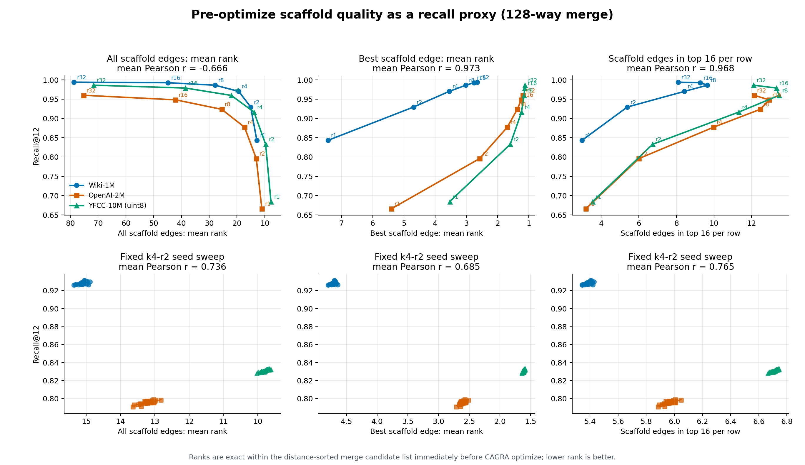
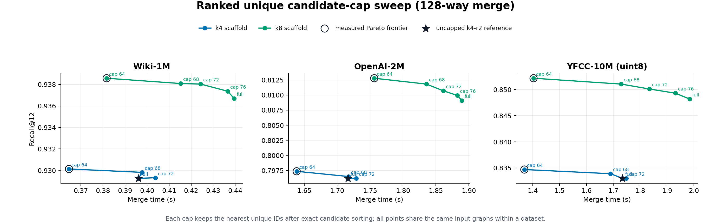
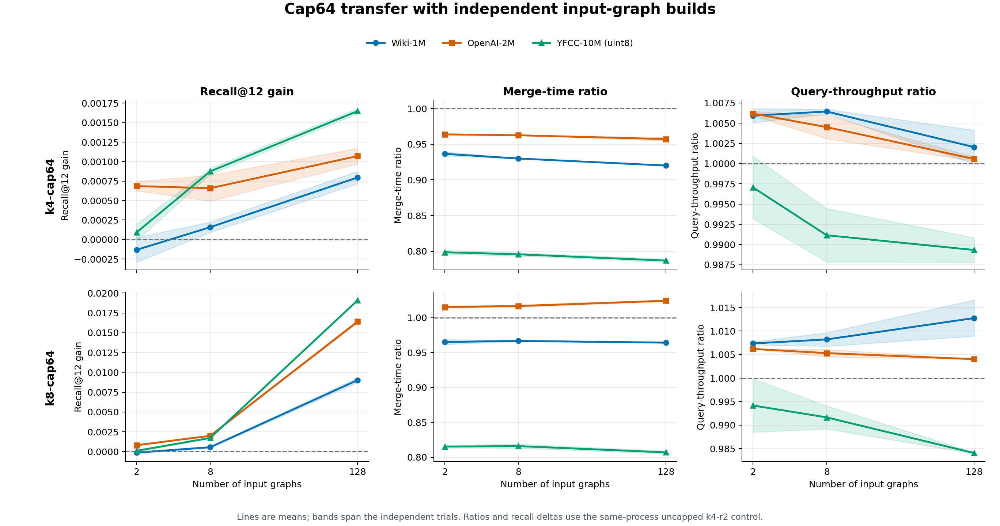
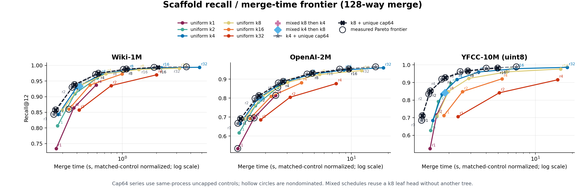
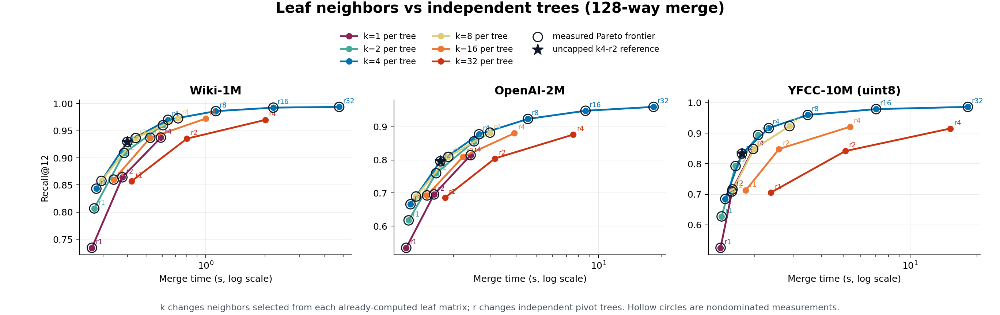
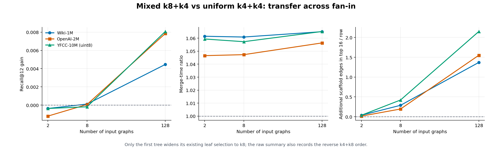

# Scaffold-neighbor quality and Fastener recall

## Conclusions

The original intuition is useful, with one qualification: **scaffold-neighbor rank predicts final
recall when the candidate budget and optimizer regime are held fixed**. It is not meaningful to
compare raw mean rank across configurations that intentionally add different amounts of tail.

At fixed k=4, two-tree work, 33 pivot-tree seeds per dataset show that better pre-optimize scaffold
neighbors predict better final Recall@12. The strongest simple statistic is the mean number of
unique scaffold edges per row found in the first 16 positions of the exact distance-sorted merge
candidate list. Its mean within-dataset Pearson correlation with final recall is **0.765** (0.593 on
Wiki, 0.788 on OpenAI, and 0.915 on YFCC). Sign-flipped all-edge mean rank, the metric in the
original hypothesis, also works at fixed budget (mean Pearson **0.736**).

Across repeat counts, all-edge mean rank is anti-predictive because another tree adds both useful
head edges and a longer tail. Best-edge rank (mean Pearson **0.973**) and top-16 useful-edge count
(**0.968**) remain predictive across repeats. The actionable interpretation is therefore not
"minimize average rank at any cost"; it is **put more scaffold edges in the useful head and do not
expose the tail to optimization**.

That interpretation produced the strongest result in this study. Generate k=4 or k=8 candidates,
exact-sort the combined graph, retain the first 64 unique IDs, and still run the normal CAGRA
connectivity/prune/reverse-edge optimizer. In two independent trials with separately built input
subgraphs:

- **k4-cap64 strictly beats the then-current uncapped k4-r2 point at every 8- and 128-way case.** At
  128-way it is 8.0%/4.3%/21.3% faster and gains
  +0.00080/+0.00107/+0.00165 recall on Wiki/OpenAI/YFCC.
- **k8-cap64 is the higher-recall Pareto point.** At 128-way it is 3.6% faster / 2.4% slower /
  19.3% faster than the former k4-r2 default and gains +0.00903/+0.01640/+0.01909 recall.
- At 8-way, k4-cap64 is 7.0%/3.7%/20.4% faster with positive recall deltas on all datasets.
  k8-cap64 remains faster on Wiki/YFCC and only 1.7% slower on OpenAI, with larger gains.
- At 2-way, cap64 still saves 3.6%-20.1% for k4. Recall is positive on OpenAI and YFCC, while the
  two Wiki trials straddle zero (mean -0.00013). The conservative policy from that study was to keep
  the then-current 2-way behavior and apply cap64 starting at 8-way.
- **Cap64 strictly dominates its matched uncapped control in all 33 configurations of the full
  128-way repeat sweep.** Merge-time ratios span 0.955x down to 0.309x while recall improves by
  +0.000342 to +0.007683. The benefit generally grows with the number and width of the repeated
  scaffold trees.

The production policy now uses k4-r8 and caps the distance-sorted unique optimizer input at the
requested output graph degree. Thus degree-64 merges use cap64, while other output degrees resolve
the cap dynamically rather than inheriting a hard-coded 64. An explicit zero disables the cap. The
matched 128-way sweep directly confirms that k4-r8-cap64 is faster and higher-recall than uncapped
k4-r8 on all three datasets; lower-fan-in independent confirmation in this report used r2.

## What is measured

Fastener concatenates the input graphs, builds cross-partition scaffold edges, appends them to the
input graphs, exact-distance sorts the combined candidate graph, and runs the CAGRA graph optimizer
back to degree 64. The instrumentation samples rows immediately after the exact sort and before any
ranked cap or optimization.

For each sampled row it records:

- the number of unique scaffold IDs before padding;
- the 1-based position of every unique scaffold ID in the sorted candidate graph;
- mean rank across all scaffold IDs;
- mean rank of the best scaffold ID and of the best four;
- fractions and implied counts ranked at most 16, 32, 64, and the output degree; and
- the number of scaffold IDs unexpectedly absent from the sorted candidate graph.

These are exact **candidate-list ranks**, not global exact-nearest-neighbor ranks over the full
dataset. Candidate-list rank is the local decision boundary seen by the optimizer and can be
measured for 65,536 evenly sampled rows in about one millisecond. Every recorded run has zero
missing scaffold candidates. Instrumentation is opt-in; normal merges do not allocate its buffers
or launch its kernel.

All result tables use merge time with the metric-measurement wall time removed. Oracular input
partition graph construction, dataset reads, and query transfer are excluded.

## Experimental design

All experiments use graph degree 64, intermediate graph degree 128, search itopk=160, every query
and ground-truth row, and an H100 PCIe. The datasets are Wiki-1M float32, OpenAI-2M float32, and
YFCC-10M uint8.

The controls are:

1. **Repeat sweep:** k=4 with 1, 2, 4, 8, 16, and 32 independent trees at 128-way fan-in on all
   three datasets (18 runs).
2. **Fixed-budget seed sweep:** 33 base seeds at k=4, two trees, and 128-way fan-in (99 runs).
3. **Repeatability:** 12 identical seed-1234 Wiki-128 merges in one process.
4. **Leaf-width sweep:** k=1/2/8/16/32 crossed with 1, 2, and 4 trees at 128-way fan-in (45 runs),
   plus matched k4/k8 checks at 2 and 8-way.
5. **Mixed-width sweep:** k4+k4, k8+k4, k4+k8, and k8+k8 at 2/8/128-way (36 runs).
6. **Ranked-cap sweep:** k4 and k8 with retained unique widths 64/68/72/76 or full width at
   2/8/128-way (81 valid runs; k4-cap76 is invalid because its full candidate degree is 72).
7. **Independent cap64 confirmation:** cap0 and cap64 for k4 and k8 at 2/8/128-way, rebuilding the
   input subgraphs in separate processes (36 runs).
8. **Full cap64 repeat sweep:** matched cap0/cap64 pairs for k4 at r1/2/4/8/16/32 and k8 at
   r1/2/4/8/16, all at 128-way fan-in (66 runs). k8-r32 is excluded because its 256-edge union is
   one past the current uint8 degree limit.

## Does pre-optimize quality predict recall?

The table reports mean within-dataset Pearson correlation. Rank metrics are sign-flipped so that a
positive value means better quality predicts higher recall.

| metric | vary repeats | vary seed at fixed k4-r2 |
| --- | ---: | ---: |
| all-edge mean rank | -0.666 | 0.736 |
| best-edge mean rank | 0.973 | 0.685 |
| best-four mean rank | 0.963 | 0.700 |
| count with rank <= 16 | 0.968 | **0.765** |
| count with rank <= 32 | 0.930 | 0.666 |
| count with rank <= 64 | 0.844 | 0.279 |

The fixed-budget seed sweep is the cleaner diagnostic. Candidate count and nominal work are fixed,
so seed variation isolates whether a better scaffold realization produces a better final graph.
Top-16 useful-edge count is the strongest single proxy there. Counts at looser thresholds weaken:
nearly every k4 scaffold edge is already in the first 64 positions at 128-way fan-in, so rank<=64
has little seed-to-seed discrimination.

Across repeats, best-edge rank is monotonic with recall on every dataset, but it mostly says whether
another independent tree found at least one excellent bridge. Top-16 count is more useful for design:
it rewards head mass while exposing configurations that add candidates the optimizer is unlikely to
use.

### Noise and seed controls

Across 12 identical Wiki-128 merges, every proxy metric is bit-for-bit identical. Recall standard
deviation is 0.000068, total range is 0.000250, and merge-time standard deviation is 2.99 ms. The
cap64 tables below use matched controls and report the mean of two independently rebuilt input-graph
trials; their min/max bands are retained in the CSV and transfer plot.

Seed 1234 is already the best aggregate-recall seed among the 33 tested and is near the top of the
proxy metrics. No other seed improves all three datasets, so changing the production seed is not a
supported shortcut.

## Proxy-guided construction experiments

### Reusing a leaf matrix: k8 is useful, k16/k32 are not

Selecting more IDs from an already-computed leaf distance matrix is cheaper than building another
pivot tree. At two trees and 128-way fan-in, uncapped k8 raises top-16 useful-edge count by
2.21/2.61/3.58 edges per row and raises recall by +0.00705/+0.01337/+0.01500 for
1.10x/1.09x/1.13x merge time on Wiki/OpenAI/YFCC.

Uncapped k16 adds essentially no further two-tree recall, and k32 regresses. One k8 tree is also much
worse than two k4 trees at the same nominal eight-edge budget: independent tree diversity is more
valuable than a wider selection from one partition. k8 is a complementary widening operation, not a
replacement for the second tree.

### Mixed k8+k4 schedules do not solve the tail problem

Widening only one of the two trees tests whether half the extra head can be obtained cheaply. At
128-way, k8+k4 gains +0.00446/+0.00785/+0.00807 recall for about 5.6%-6.5% extra time. Reversing the
order is similar and slightly worse on two of three datasets. At 8-way both orders are neutral or
negative, and at 2-way both regress.

The pre-optimize proxy explains the pattern: mixed schedules add roughly half the k8 top-16 mass,
but they still expose every added tail candidate. They are dominated by the ranked-cap points.

### Keep the head, remove the tail

The ranked-cap implementation takes the exact distance-sorted candidate graph, keeps the first
unique IDs in order, and pads only if fewer than the requested width remain. A naive first-prefix
version failed because duplicates could leave too few valid IDs. The correct implementation is one
warp per row: each lane tests first occurrence, a ballot computes output positions, and the warp
emits the unique sorted prefix.

The warp implementation preserves the serial algorithm's result while reducing the widened
variant's excess cost by **1.37x-5.42x** across the nine 2/8/128-way cases. The improvement is largest
on 10M-row YFCC. This made a retained-width sweep practical.

Cap64 wins every 128-way dataset for both k4 and k8: increasing retained width to 68, 72, 76, or full
candidate degree makes merge slower and lowers recall. Cap64 is not a no-optimize path. CAGRA still
runs MST/connectivity handling, graph pruning, reverse-graph construction, and graph merge; it just
receives a distance-ranked, duplicate-free graph whose input width equals its output width.

## Replicated cap64 results

Each value below is the mean of two trials whose input partition graphs were rebuilt independently.
Time and QPS are ratios to the same-process uncapped k4-r2 control. Full min/max ranges are in
[the cap64 summary](merge_api_results/scaffold_cap64_transfer_summary.csv) and shown as bands in the
transfer figure.

### 128-way

| dataset | k4-cap64 time | k4 recall delta | k4 QPS | k8-cap64 time | k8 recall delta | k8 QPS |
| --- | ---: | ---: | ---: | ---: | ---: | ---: |
| Wiki-1M | **0.920x** | +0.000796 | 1.002x | **0.964x** | +0.009025 | 1.013x |
| OpenAI-2M | **0.957x** | +0.001071 | 1.001x | 1.024x | +0.016400 | 1.004x |
| YFCC-10M | **0.787x** | +0.001648 | 0.989x | **0.807x** | +0.019089 | 0.984x |

### 8-way

| dataset | k4-cap64 time | k4 recall delta | k4 QPS | k8-cap64 time | k8 recall delta | k8 QPS |
| --- | ---: | ---: | ---: | ---: | ---: | ---: |
| Wiki-1M | **0.930x** | +0.000159 | 1.006x | **0.967x** | +0.000558 | 1.008x |
| OpenAI-2M | **0.963x** | +0.000659 | 1.005x | 1.017x | +0.001999 | 1.005x |
| YFCC-10M | **0.796x** | +0.000874 | 0.991x | **0.816x** | +0.001734 | 0.992x |

### 2-way

| dataset | k4-cap64 time | k4 recall delta | k4 QPS | k8-cap64 time | k8 recall delta | k8 QPS |
| --- | ---: | ---: | ---: | ---: | ---: | ---: |
| Wiki-1M | **0.937x** | -0.000133 | 1.006x | **0.965x** | -0.000121 | 1.007x |
| OpenAI-2M | **0.964x** | +0.000686 | 1.006x | 1.015x | +0.000812 | 1.006x |
| YFCC-10M | **0.799x** | +0.000091 | 0.997x | **0.815x** | +0.000103 | 0.994x |

The modest QPS movement is a graph-topology effect because every output remains degree 64. The worst
mean QPS change is -1.6% for YFCC-128 k8-cap64; Wiki and OpenAI generally improve slightly.

## Cap64 across repeats

The full 128-way sweep pairs cap0 and cap64 in the same process. The endpoint columns run from r1 to
the widest valid repeat count: r32 for k4 and r16 for k8.

| dataset | k4 time r1 -> r32 | k4 recall delta r1 -> r32 | k8 time r1 -> r16 | k8 recall delta r1 -> r16 |
| --- | ---: | ---: | ---: | ---: |
| Wiki-1M | 0.914x -> **0.769x** | +0.000475 -> +0.001458 | 0.876x -> **0.649x** | +0.000950 -> +0.002625 |
| OpenAI-2M | 0.955x -> **0.865x** | +0.000342 -> +0.004709 | 0.934x -> **0.788x** | +0.001425 -> +0.007683 |
| YFCC-10M | 0.812x -> **0.387x** | +0.000586 -> +0.002871 | 0.759x -> **0.309x** | +0.002054 -> +0.005170 |

Every capped configuration is faster and higher-recall than its matched uncapped control; QPS stays
between 0.986x and 1.038x. The capped k4 points at r1/2/4/8/16/32 are all globally nondominated in
the measured set. Capped k8 adds a higher-recall Pareto point through r8 on every dataset. At r16,
k8 is dominated by k4 on Wiki; on OpenAI and YFCC it buys +0.000550/+0.001020 recall for 1.189x/1.237x
the k4-r16-cap64 time.

## Recommended policy

For the measured graph-degree-64 regime:

1. **Production default:** use k4-r8 and cap the distance-sorted unique optimizer input at the
   requested output degree. At degree 64 this is k4-r8-cap64. It is on the measured 128-way frontier
   and strictly improves merge time and recall over its matched uncapped r8 control on all datasets.
2. **Cap semantics:** the full combined candidate graph is distance-sorted before unique-prefix
   pruning. Zero explicitly disables the cap; a positive override must be at least the requested
   output degree.
3. **Low-fan-in evidence boundary:** the independent 2/8/128-way transfer study used r2. At fan-in 2,
   cap64 was faster and nearly recall-neutral, but Wiki's two-trial mean was slightly negative. Users
   dominated by this case can opt out with cap0 pending an independent r8 replication.
4. **Higher-recall width option:** k8-cap64 supplies a Pareto point through r8. At r16, prefer k4 by
   default: k8 is dominated on Wiki and its OpenAI/YFCC recall gains are only +0.000550/+0.001020 for
   18.9%/23.7% more merge time.
5. **Higher-repeat option:** capped k4-r16/r32 remain on the measured 128-way frontier and strictly
   improve on their uncapped counterparts, at greater merge cost than r8.
6. Do not use k16, k32, or a mixed-width schedule as a default; each is dominated in this study.

The recommendation is limited to the three datasets, L2 distance, graph degree 64, and H100 tested
here. Candidate-list rank is a strong within-regime proxy, not proof that the same thresholds or cap
transfer to another output degree or metric.

## Reproduction and artifacts

Build the benchmark and run the main controls:

    cmake --build experiments/cpp/build-local --target CAGRA_MERGE_API_BENCH -j16
    PARTS=128 bash experiments/cpp/run_scaffold_quality.sh
    bash experiments/cpp/run_scaffold_seed_quality.sh
    bash experiments/cpp/run_scaffold_degree_quality.sh

Run the final mixed and cap experiments into fresh CSV paths:

    OUTPUT_CSV=experiments/cpp/merge_api_results/scaffold_mixed_width_quality.csv \
      PARTS="128 8 2" NEIGHBORS="4 8" FIRST_NEIGHBORS="4 8" REPEATS=2 \
      bash experiments/cpp/run_scaffold_degree_quality.sh

    OUTPUT_CSV=experiments/cpp/merge_api_results/scaffold_cap_width_quality.csv \
      PARTS="128 8 2" NEIGHBORS="4 8" REPEATS=2 CANDIDATE_CAPS="0 64 68 72 76" \
      bash experiments/cpp/run_scaffold_degree_quality.sh

    OUTPUT_CSV=experiments/cpp/merge_api_results/scaffold_cap64_confirmation.csv \
      PARTS="128 8 2" NEIGHBORS="4 8" REPEATS=2 CANDIDATE_CAPS="0 64" \
      bash experiments/cpp/run_scaffold_degree_quality.sh

    bash experiments/cpp/run_scaffold_cap64_repeats.sh

Generate all derived CSVs and PNG/SVG figures:

    python3 experiments/cpp/plot_scaffold_quality.py

Key raw data:

- [repeat sweep](merge_api_results/scaffold_rank_quality.csv)
- [fixed-budget seed sweep](merge_api_results/scaffold_seed_quality.csv)
- [identical-seed control](merge_api_results/scaffold_repeatability_wiki.csv)
- [leaf-width sweep](merge_api_results/scaffold_degree_quality.csv)
- [uncapped low-fan-in controls](merge_api_results/scaffold_k8_confirmation.csv)
- [mixed-width sweep](merge_api_results/scaffold_mixed_width_quality.csv)
- [cap-width sweep](merge_api_results/scaffold_cap_width_quality.csv)
- [independent cap64 confirmation](merge_api_results/scaffold_cap64_confirmation.csv)
- [full cap64 repeat sweep](merge_api_results/scaffold_cap64_repeat_quality.csv)
- [serial cap72 control](merge_api_results/scaffold_k8_cap72.csv)
- [warp cap72 control](merge_api_results/scaffold_k8_cap72_warp.csv)

Key derived data:

- [all normalized rows](merge_api_results/scaffold_quality_derived.csv)
- [proxy correlations](merge_api_results/scaffold_quality_correlations.csv)
- [leaf-width summary](merge_api_results/scaffold_degree_quality_summary.csv)
- [mixed-width summary](merge_api_results/scaffold_mixed_width_summary.csv)
- [cap-width summary](merge_api_results/scaffold_cap_width_summary.csv)
- [cap64 replicated transfer summary](merge_api_results/scaffold_cap64_transfer_summary.csv)
- [cap64 repeat impact summary](merge_api_results/scaffold_cap64_repeat_summary.csv)
- [cap-kernel speed summary](merge_api_results/scaffold_cap_kernel_summary.csv)
- [high-fan-in efficiency frontier](merge_api_results/scaffold_efficiency_summary.csv)

The analysis is implemented in [plot_scaffold_quality.py](plot_scaffold_quality.py); the repeat,
seed, generalized degree/schedule/cap, and full cap64 repeat runners are
[run_scaffold_quality.sh](run_scaffold_quality.sh),
[run_scaffold_seed_quality.sh](run_scaffold_seed_quality.sh), and
[run_scaffold_degree_quality.sh](run_scaffold_degree_quality.sh), and
[run_scaffold_cap64_repeats.sh](run_scaffold_cap64_repeats.sh).
