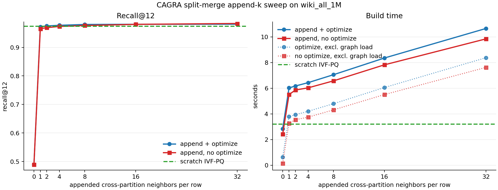

# CAGRA Split Merge Construction Experiments

## Dataset

Source split artifacts: `/raid/blandrum/split-wiki`

Current artifact manifest:

- Rows: 1,000,000 total, split into two 500,000-row partitions
- Dim: 768
- Queries: 10,000
- Partition build: CAGRA IVF-PQ, graph degree 64, intermediate graph degree 128
- Existing query-time partition merge recall@12 vs brute force: 0.981892
- Existing query-time partition search+merge: 152.545641 ms

## Harness

New binary: `experiments/cpp/build-nosccache/CAGRA_SPLIT_MERGE_CONSTRUCTION`

The harness loads the split partition indexes, builds an initial merged graph from the partition CAGRA graphs, injects candidates according to the selected variant, and then either:

- runs seeded NN-Descent, sorts the resulting kNN graph by real distance, optimizes with CAGRA, and searches the merged index;
- with `--skip-nnd`, sorts and optimizes the mixed seed graph directly; or
- with `--skip-nnd --skip-optimize`, constructs the searchable merged index directly from the raw mixed seed graph.

CSV output: `/raid/blandrum/split-wiki/merge_construction_results.csv`

For k-way experiments, the harness now discovers numerically sorted `part_*` directories under `--split-dir`. `--part-start` and `--part-count` restrict evaluation to a contiguous subset of parts, while `--part-list <ids>` selects arbitrary zero-based part indices in the given order. That lets OOM all-at-once methods be evaluated at smaller fan-in by merging fewer subgraphs from the same split, and it makes repeated non-contiguous fan-in samples possible. `--groundtruth <neighbors.ibin>` maps source-ID ground truth through `original_ids.ibin` for full-dataset evaluations without running brute force. The `query-window` candidate strategy queries the next `--query-window-size` partitions in ring order, filling the gap between one-target `query-one` and all-to-all `query-all`. The `query-sampled` strategy samples `--target-sample-rows` rows per source part, scores all target parts by average sampled k=1 search distance, then queries the best `--query-window-size` targets for every row. The `query-routed` strategy does a row-level k=1 routing prepass against all non-self target partitions, keeps the nearest `--query-window-size` target partitions for each row, and only runs the full append candidate search against those routed targets. Query strategies now support `--candidate-query-count`, which separates per-target CAGRA search result count from per-row append capacity. The `query-boundary` strategy light-searches every non-self target with `--boundary-light-count`; with `--boundary-fraction 0`, this is equivalent to `query-all --candidate-query-count <light>` into the larger append capacity, while positive boundary fractions also score rows by nearest-cross / farthest-within light distance and run the full append search only for the lowest-score rows.

Figure: 

The build-time subplot uses solid lines for measured end-to-end variant build time and dotted lines for the same rows after subtracting partition graph load.

Important timing note: `variant_build_ms` includes partition index deserialization / graph loading (`load_graph_ms`). A production merge API receiving already-live indexes should compare against `variant_build_ms - load_graph_ms`.

## Full-Size Results

Scratch baseline over the combined 1M-row dataset:

| Label | Build ms | Search ms | Recall@12 | Notes |
|---|---:|---:|---:|---|
| `full_scratch_ivfpq` | 3218.448 | 91.759 | 0.974558 | Public CAGRA build, IVF-PQ graph build |

Selected merge-construction variants:

| Label | Strategy | Insert | Sample | Candidates | Candidate itopk | Build ms | Build ms excl. load | Search ms | Recall@12 | Notes |
|---|---|---|---:|---:|---:|---:|---:|---:|---:|---|
| `full_seed_partition_only` | none + seeded NN-Descent | append | 1.00 | 0 | n/a | 57966.563 | 55826.697 | 94.010 | 0.982858 | Quality high, NN-Descent dominates at 54.8 s |
| `full_seed_partition_only_iter5` | none + seeded NN-Descent | append | 1.00 | 0 | n/a | 26069.747 | 23803.210 | 97.997 | 0.919367 | Lower iterations too low recall |
| `full_random_append32_iter5` | random-global + seeded NN-Descent | append | 1.00 | 32 | n/a | 30511.640 | 28284.547 | 99.247 | 0.736817 | Random candidates did not help low-iter NN-Descent |
| `full_nnd_query_append2_canditopk2_iter5` | query opposite index + seeded NN-Descent | append | 1.00 | 2 | 2 | 29454.267 | 27272.807 | 63.568 | 0.951317 | Query candidates help vs random but still below scratch and slow |
| `full_nnd_query_append2_canditopk2_iter1` | query opposite index + seeded NN-Descent | append | 1.00 | 2 | 2 | 23242.754 | 19245.984 | 64.673 | 0.863100 | Minimal NN-Descent damages the direct seed graph |
| `full_nnd_query_append2_canditopk2_iter2` | query opposite index + seeded NN-Descent | append | 1.00 | 2 | 2 | 23248.985 | 20968.159 | 64.565 | 0.880533 | Still far below direct optimize |
| `full_nnd_query_append2_canditopk2_iter3` | query opposite index + seeded NN-Descent | append | 1.00 | 2 | 2 | 25276.628 | 23018.565 | 64.358 | 0.901983 | Improves slowly, still below scratch/direct |
| `full_direct_partition_only` | none, direct optimize | append | 1.00 | 0 | n/a | 2844.602 | 627.699 | 92.715 | 0.489600 | Fast but disconnected across partitions |
| `full_direct_random_append32` | random-global, direct optimize | append | 1.00 | 32 | n/a | 4978.102 | 2754.907 | 99.081 | 0.501500 | Random global edges insufficient |
| `full_direct_query_append1_canditopk1` | query opposite index, direct optimize | append | 1.00 | 1 | 1 | 6024.142 | 3781.620 | 60.546 | 0.971725 | Just below scratch recall |
| `full_direct_query_append2_canditopk2` | query opposite index, direct optimize | append | 1.00 | 2 | 2 | 6171.050 | 3936.804 | 60.295 | 0.975108 | Smallest tested candidate count above scratch recall |
| `full_direct_query_all_append2_canditopk2` | query every other index, direct optimize | append | 1.00 | 2 | 2 | 6291.284 | 4007.985 | 60.265 | 0.975142 | Same strategy as query-one for two partitions |
| `full_direct_query_append4_canditopk4` | query opposite index, direct optimize | append | 1.00 | 4 | 4 | 6432.502 | 4204.649 | 60.009 | 0.977417 | Better recall, modest extra build time |
| `full_direct_query_append8_canditopk8` | query opposite index, direct optimize | append | 1.00 | 8 | 8 | 7052.322 | 4794.978 | 60.071 | 0.980325 | Close to query-time split-merge recall |
| `full_direct_query_append32` | query opposite index, direct optimize | append | 1.00 | 32 | 64 | 13076.654 | 10840.823 | 60.279 | 0.981642 | Highest direct recall, candidate search expensive |
| `full_direct_query_append32_sample10` | query opposite index, direct optimize | append | 0.10 | 32 | 64 | 5871.210 | 3672.896 | 64.640 | 0.873067 | Sampling 10% loses too much recall |
| `full_direct_query_append32_sample50` | query opposite index, direct optimize | append | 0.50 | 32 | 64 | 9215.222 | 6942.650 | 62.537 | 0.959975 | Still below scratch recall |
| `full_direct_query_append32_sample75` | query opposite index, direct optimize | append | 0.75 | 32 | 64 | 11220.628 | 8938.967 | 61.418 | 0.974125 | Nearly scratch recall, still slower |
| `full_direct_query_replace8_random` | query opposite index, direct optimize | replace | 1.00 | 8 | 64 | 14478.177 | 12322.101 | 59.883 | 0.979292 | Fixed degree, but replacement slot selection is costly |
| `full_direct_query_replace8_farthest_sample10` | query opposite index, direct optimize | replace | 0.10 | 8 | 64 | 54774.543 | 52586.737 | 60.187 | 0.966167 | CPU distance ranking dominates |
| `full_direct_query_replace8_nearest_sample10` | query opposite index, direct optimize | replace | 0.10 | 8 | 64 | 55520.264 | 53296.153 | 60.325 | 0.965692 | No quality win; also very expensive |

## One-Point Search Recall

The recall numbers in this log were evaluated with CAGRA's default single-point search initialization: `search_width = 1` and `num_random_samplings = 1`. Candidate-generation searches also used those defaults unless otherwise noted; the `candidate_itopk` sweep only changes `itopk_size`.

Focused promising rows under this caveat:

| Label | Build ms | Build ms excl. load | Search ms | Recall@12 |
|---|---:|---:|---:|---:|
| `full_scratch_ivfpq` | 3218.448 | 3218.448 | 91.759 | 0.974558 |
| `full_direct_query_append2_canditopk2` | 6171.050 | 3936.804 | 60.295 | 0.975108 |
| `full_direct_query_all_append2_canditopk2` | 6291.284 | 4007.985 | 60.265 | 0.975142 |
| `full_direct_query_append2_canditopk8` | 6643.911 | 4422.506 | 60.113 | 0.976617 |
| `full_direct_query_append4_canditopk4` | 6432.502 | 4204.649 | 60.009 | 0.977417 |
| `full_direct_query_append4_canditopk8` | 6724.300 | 4507.140 | 59.943 | 0.978083 |
| `full_direct_query_append8_canditopk8` | 7052.322 | 4794.978 | 60.071 | 0.980325 |
| `full_direct_query_append8_canditopk16` | 7775.009 | 5515.512 | 59.911 | 0.980533 |
| `full_direct_query_append32` | 13076.654 | 10840.823 | 60.279 | 0.981642 |
| `full_noopt_query_append8_canditopk8` | 6572.475 | 4314.049 | 65.048 | 0.976608 |
| `full_noopt_query_append16_canditopk16` | 7819.357 | 5503.502 | 71.327 | 0.980758 |
| `full_noopt_query_append32_canditopk32` | 9842.454 | 7622.091 | 84.193 | 0.983792 |
| `full_direct_query_replace8_random` | 14478.177 | 12322.101 | 59.883 | 0.979292 |
| `full_seed_partition_only` | 57966.563 | 55826.697 | 94.010 | 0.982858 |

## Candidate Beam Sweep

These runs use direct optimize (`--skip-nnd`) with query candidates and full-row append. `Candidate itopk` is the CAGRA search beam used while querying the other partition index to generate candidates.

| Appended candidates | Candidate itopk | Build ms | Candidate ms | Recall@12 |
|---:|---:|---:|---:|---:|
| 1 | 1 | 6024.142 | 3069.753 | 0.971725 |
| 2 | 2 | 6171.050 | 3159.222 | 0.975108 |
| 2 | 4 | 6400.927 | 3366.378 | 0.976317 |
| 2 | 8 | 6643.911 | 3663.194 | 0.976617 |
| 2 | 16 | 7316.540 | 4346.267 | 0.976642 |
| 2 | 64 | 11210.872 | 8233.866 | 0.976167 |
| 4 | 4 | 6432.502 | 3342.929 | 0.977417 |
| 4 | 8 | 6724.300 | 3649.936 | 0.978083 |
| 4 | 16 | 7651.286 | 4472.028 | 0.978333 |
| 4 | 64 | 11346.589 | 8189.255 | 0.977783 |
| 8 | 8 | 7052.322 | 3700.404 | 0.980325 |
| 8 | 16 | 7775.009 | 4418.915 | 0.980533 |
| 16 | 16 | 8350.410 | 4484.880 | 0.980933 |
| 32 | 32 | 10652.506 | 5803.232 | 0.981275 |
| 8 | 64 | 11560.185 | 8221.669 | 0.979933 |

Beam-width takeaway: increasing candidate search beam helps a little up to about 8-16, but recall saturates quickly and larger beams mostly increase candidate search time. Returning more appended candidates has a larger effect than widening the beam after a modest value.

## No-Optimize Append Sweep

These runs add `--skip-optimize` on top of `--skip-nnd`, so the mixed seed graph is searched directly. In append mode that raw graph has degree `64 + append_k`; the optimized runs sort the mixed graph and then CAGRA-prune it back to `graph_degree = 64`. That degree difference is important when interpreting high-k no-optimize recall.

| Appended candidates | Optimized build ms | Optimized search ms | Optimized recall@12 | No-opt build ms | No-opt search ms | No-opt recall@12 |
|---:|---:|---:|---:|---:|---:|---:|
| 0 | 2844.602 | 92.715 | 0.489600 | 2419.519 | 91.723 | 0.489625 |
| 1 | 6024.142 | 60.546 | 0.971725 | 5501.478 | 59.766 | 0.965483 |
| 2 | 6171.050 | 60.295 | 0.975108 | 5858.704 | 60.604 | 0.969192 |
| 4 | 6432.502 | 60.009 | 0.977417 | 6027.949 | 62.076 | 0.973375 |
| 8 | 7052.322 | 60.071 | 0.980325 | 6572.475 | 65.048 | 0.976608 |
| 16 | 8350.410 | 60.033 | 0.980933 | 7819.357 | 71.327 | 0.980758 |
| 32 | 10652.506 | 60.211 | 0.981275 | 9842.454 | 84.193 | 0.983792 |

No-optimize shows that the cross-query append itself carries most of the quality: append1 reaches `0.965483` recall@12, append8 is already above scratch IVF-PQ (`0.976608` vs `0.974558`), and append16 is effectively tied with optimized append16. At low k, optimize is still worth about `0.004` to `0.006` absolute recall for roughly `0.3` to `0.5 s` extra build time. At k32, no-optimize has the highest recall in this sweep (`0.983792`), but it is searching a degree-96 raw graph and search time rises to `84.193 ms`; the optimized degree-64 rows stay near `60 ms` search time.

## Multi-Way wiki_all_10M Results

10-way split artifacts live at `/raid/blandrum/split-wiki-10m-10way`. The split is seeded random k-way over `wiki_all_10M`, with ten 1M-row parts, graph degree 64, intermediate graph degree 128, and IVF-PQ-built CAGRA graphs for each part. Result rows are copied to `experiments/cpp/merge_construction_results_10way.csv`.

Full 10-way rows below use `--groundtruth /raid/blandrum/local_datasets/wiki_all_10M/groundtruth.10M.neighbors.ibin`, so `bf_ms` is ground-truth loading/mapping time rather than brute-force search time.

| Label | Parts | Strategy | Append k | Build ms | Candidate ms | Search ms | Recall@12 | Notes |
|---|---:|---|---:|---:|---:|---:|---:|---|
| `full10_noopt_append0` | 10 | no optimize, no cross candidates | 0 | 32496.823 | 0.011 | 97.008 | 0.097592 | Disconnected 10-way floor, about one partition's worth of neighbors |
| `full10_noopt_query_one_append2_canditopk2` | 10 | no optimize, ring query-one | 2 | 53864.023 | 29973.908 | 65.732 | 0.575333 | One target partition per source is not enough, but repairs much of the disconnected floor |
| `full10_noopt_query_all_append2_canditopk2` | 10 | no optimize, query all other parts | 2 | 145437.853 | 121098.490 | 66.259 | 0.760125 | All-to-all cross candidates help but append2 under-doses multi-way connectivity |
| `full10_noopt_query_all_append8_canditopk8` | 10 | no optimize, query all other parts | 8 | 207260.762 | 180505.268 | 71.539 | 0.883258 | Higher raw degree improves recall; candidate generation dominates |
| `full10_noopt_query_one_append16_canditopk16` | 10 | no optimize, ring query-one | 16 | 78438.070 | 47018.437 | 79.388 | 0.835525 | Much cheaper than all-to-all append16, but routing diversity is too low |
| `full10_noopt_query_window3_append16_canditopk16` | 10 | no optimize, query next 3 parts | 16 | 135619.117 | 104405.667 | 79.257 | 0.889517 | Saves `185.6 s` candidate time vs all-to-all append16, loses `0.025183` recall |
| `full10_noopt_query_window5_append16_canditopk16` | 10 | no optimize, query next 5 parts | 16 | 193292.362 | 162128.962 | 79.138 | 0.903625 | Better recall/cost tradeoff, still below all-to-all |
| `full10_noopt_query_sampled3_s1024_append16_canditopk16` | 10 | no optimize, sampled best 3 parts | 16 | 156964.315 | 125663.383 | 77.854 | 0.640217 | Source-part average-distance routing is much worse than ring window3 |
| `full10_noopt_query_sampled5_s1024_append16_canditopk16` | 10 | no optimize, sampled best 5 parts | 16 | 214435.732 | 183379.902 | 78.017 | 0.732767 | Still much worse than ring window5 despite higher cost |
| `full10_noopt_query_all_append16_canditopk16` | 10 | no optimize, query all other parts | 16 | 321798.768 | 290036.318 | 78.367 | 0.914700 | Best full 10-way no-opt row so far, but expensive and searches degree 80 |
| `full10_noopt_query_all_append16_queryk4_canditopk16` | 10 | no optimize, query all other parts with query k=4 | 16 | 276078.383 | 244350.958 | 78.397 | 0.914617 | Cheapest full all-to-all append16 row so far, essentially recall-neutral |
| `full10_noopt_query_all_append16_queryk4_itopk16_canditopk16` | 10 | no optimize, query all other parts with query k=4 and candidate itopk=16 | 16 | 273264.598 | 242208.331 | 78.422 | 0.914617 | Same recall as query-k4 default beam, only `2.1 s` cheaper in candidate generation |
| `full10_noopt_query_all_append16_queryk6_canditopk16` | 10 | no optimize, query all other parts with query k=6 | 16 | 282448.124 | 250902.064 | 78.391 | 0.914717 | Best full all-to-all append16 recall so far, still cheaper than query k=8/16 |
| `full10_noopt_query_all_append16_queryk8_canditopk16` | 10 | no optimize, query all other parts with query k=8 | 16 | 289822.925 | 258146.251 | 78.353 | 0.914692 | Same recall as full query k=16 while saving `31.9 s` candidate time |

Direct optimize over all ten 1M parts ran out of memory during `sort_knn_graph` while trying to allocate another `30.7 GB`. Following up on that with smaller full-subgraph subsets, these rows use brute-force ground truth over only the selected subset. That makes them fair tests of physical merge quality for a smaller fan-in, not directly comparable to the full 10-way ground-truth rows above. This is still useful for OOM cases: a method that cannot fit all 10 subgraphs at once can be evaluated by merging fewer subgraphs and tracing how recall/cost changes with fan-in.

| Label | Parts | Rows | Append k | Build ms | Candidate ms | Search ms | Recall@12 | Notes |
|---|---:|---:|---:|---:|---:|---:|---:|---|
| `sub10m_p2_direct_partition_only` | 2 | 2M | 0 | 6239.668 | 0.012 | 96.619 | 0.484942 | Two disconnected 1M graphs; optimize alone does not invent cross edges |
| `sub10m_p2_direct_query_all_append2_canditopk2` | 2 | 2M | 2 | 13047.890 | 6645.077 | 62.936 | 0.949942 | Strong repair, but below the earlier 1M 50/50 append2 result |
| `sub10m_p3_direct_query_all_append2_canditopk2` | 3 | 3M | 2 | 21916.257 | 12794.442 | 63.560 | 0.934550 | Recall drops as fan-in grows; append2 is under-dosed |
| `sub10m_p3_direct_query_all_append8_canditopk8` | 3 | 3M | 8 | 27466.584 | 17308.827 | 63.144 | 0.951658 | More cross candidates recover quality for 3-way merge |
| `sub10m_p4_direct_query_all_append8_canditopk8` | 4 | 4M | 8 | 44157.728 | 30624.291 | 63.554 | 0.945133 | Still fits; recall starts trending down |
| `sub10m_p5_direct_query_all_append8_canditopk8` | 5 | 5M | 8 | 61588.528 | 45877.280 | 63.802 | 0.938825 | Candidate generation dominates build time |
| `sub10m_p6_direct_query_all_append8_canditopk8` | 6 | 6M | 8 | 84043.765 | 65118.257 | 64.168 | 0.933367 | Fills the fan-in trend between p5 and p7 |
| `sub10m_p7_direct_query_all_append8_canditopk8` | 7 | 7M | 8 | 111262.136 | 89584.769 | 64.186 | 0.928450 | Large fan-in all-to-all append is expensive and lower quality |
| `sub10m_p8_direct_query_all_append8_canditopk8` | 8 | 8M | 8 | 142698.867 | 117408.442 | 64.438 | 0.922150 | Largest direct-optimize subset that fit in this run |
| `sub10m_p4_direct_query_all_append16_canditopk16` | 4 | 4M | 16 | 58287.627 | 43120.508 | 63.724 | 0.953092 | More cross candidates recover `+0.007959` recall over append8 |
| `sub10m_p4_direct_query_all_append16_queryk8_canditopk16` | 4 | 4M | 16 | 53668.412 | 38563.555 | 63.772 | 0.953450 | First-class light per-target query k=8 beats full query k=16 on cost and recall |
| `sub10m_p5_direct_query_all_append16_canditopk16` | 5 | 5M | 16 | 85234.483 | 66806.510 | 63.938 | 0.948067 | Recovers `+0.009242` recall over append8 |
| `sub10m_p6_direct_query_all_append16_canditopk16` | 6 | 6M | 16 | 122295.203 | 100134.090 | 64.223 | 0.945117 | Recovers `+0.011750` recall over append8, but candidate cost is now `100 s` |
| `sub10m_p6_direct_query_all_append16_queryk4_canditopk16` | 6 | 6M | 16 | 104115.017 | 82527.201 | 64.214 | 0.945483 | Query k=4 is the cheapest p6 append16 point tested and still beats full query k=16 |
| `sub10m_p6_direct_query_all_append16_queryk6_canditopk16` | 6 | 6M | 16 | 108800.408 | 86625.099 | 64.278 | 0.945942 | Best p6 append16 recall in the local query-k sweep |
| `sub10m_p6_direct_query_all_append16_queryk6_itopk16_canditopk16` | 6 | 6M | 16 | 108228.861 | 86756.574 | 64.162 | 0.946042 | Candidate itopk=16 is essentially neutral on cost and slightly improves recall |
| `sub10m_p6_parts024689_direct_query_all_append16_queryk6_itopk16_canditopk16` | 6 | 6M | 16 | 109461.727 | 87611.179 | 63.877 | 0.943242 | Non-contiguous parts `0,2,4,6,8,9`; paired baseline for append24 part-list row |
| `sub10m_p6_parts135789_direct_query_all_append16_queryk6_itopk16_canditopk16` | 6 | 6M | 16 | 109482.842 | 87699.819 | 63.935 | 0.945258 | Non-contiguous parts `1,3,5,7,8,9`; paired baseline for append24 part-list row |
| `sub10m_p6_direct_query_all_append16_queryk8_canditopk16` | 6 | 6M | 16 | 110320.275 | 88949.245 | 64.108 | 0.945675 | Query k=8 again slightly improves recall while saving `11.2 s` candidate time |
| `sub10m_p6_direct_query_all_append16_queryk12_canditopk16` | 6 | 6M | 16 | 116194.136 | 94234.496 | 64.191 | 0.945700 | Wider than k=8 costs more and does not beat k=6 |
| `sub10m_p6_direct_query_all_append24_queryk4_canditopk24` | 6 | 6M | 24 | 236971.609 | 213333.580 | 64.633 | 0.945342 | Lower query k alone is a bad append24 point here; slow and below append16/query-k6 |
| `sub10m_p6_direct_query_all_append24_queryk4_itopk24_canditopk24` | 6 | 6M | 24 | 129983.305 | 106363.212 | 64.566 | 0.942717 | Matched beam cuts time, but query k=4 under-doses append24 and loses `0.007558` recall vs query-k6/itopk24 |
| `sub10m_p6_direct_query_all_append24_queryk6_canditopk24` | 6 | 6M | 24 | 242130.627 | 217409.496 | 64.335 | 0.951617 | Best p6 quality so far, but expensive with default candidate itopk=64 |
| `sub10m_p6_direct_query_all_append24_queryk6_itopk24_canditopk24` | 6 | 6M | 24 | 136624.396 | 111720.404 | 64.293 | 0.950275 | Candidate itopk=24 preserves most quality and beats append24/query-k8 at slightly lower cost |
| `sub10m_p6_parts024689_direct_query_all_append24_queryk6_itopk24_canditopk24` | 6 | 6M | 24 | 135011.092 | 110494.778 | 64.236 | 0.947108 | Non-contiguous parts `0,2,4,6,8,9`; same cost band, lower recall than first-six p6 |
| `sub10m_p6_parts135789_direct_query_all_append24_queryk6_itopk24_canditopk24` | 6 | 6M | 24 | 134448.698 | 109977.417 | 64.005 | 0.948950 | Non-contiguous parts `1,3,5,7,8,9`; still below first-six p6 |
| `sub10m_p6_direct_query_all_append24_queryk8_canditopk24` | 6 | 6M | 24 | 138676.217 | 114143.779 | 64.487 | 0.949258 | More append capacity buys quality, but candidate-itopk24/query-k6 is better |
| `sub10m_p8_direct_query_all_append16_queryk4_canditopk16` | 8 | 8M | 16 | 181555.792 | 153112.174 | 64.354 | 0.938542 | Best p8 append16 point so far; better and cheaper than query k=6/8/16 |
| `sub10m_p8_direct_query_all_append16_queryk4_itopk16_canditopk16` | 8 | 8M | 16 | 181474.836 | 152841.812 | 64.416 | 0.938717 | Candidate itopk=16 is recall-neutral and only slightly cheaper |
| `sub10m_p8_parts01234589_direct_query_all_append16_queryk4_itopk16_canditopk16` | 8 | 8M | 16 | 180967.991 | 152551.515 | 64.529 | 0.940383 | Non-contiguous parts `0,1,2,3,4,5,8,9`; paired baseline for append24 part-list row |
| `sub10m_p8_direct_query_all_append16_queryk6_canditopk16` | 8 | 8M | 16 | 187653.540 | 158817.616 | 64.396 | 0.937383 | Below k=4 on quality and above k=4 on cost |
| `sub10m_p8_direct_query_all_append16_queryk8_canditopk16` | 8 | 8M | 16 | 193504.578 | 164270.040 | 64.367 | 0.936683 | Largest fitting fan-in so far; nearly tied with full query k=16 while cheaper |
| `sub10m_p8_direct_query_all_append16_canditopk16` | 8 | 8M | 16 | 201260.799 | 173852.831 | 64.288 | 0.936750 | Full query k=16 gains only `+0.000067` recall over query k=8 |
| `sub10m_p8_direct_query_all_append24_queryk4_canditopk24` | 8 | 8M | 24 | 228588.772 | 195958.133 | 64.543 | 0.944650 | Best p8 quality so far; append24 quality improves and lower query k reduces cost |
| `sub10m_p8_direct_query_all_append24_queryk4_itopk24_canditopk24` | 8 | 8M | 24 | 225422.234 | 192734.700 | 64.479 | 0.944600 | Candidate itopk=24 is recall-neutral, but only slightly cheaper at p8 |
| `sub10m_p8_parts01234589_direct_query_all_append24_queryk4_itopk24_canditopk24` | 8 | 8M | 24 | 229682.581 | 197051.178 | 64.641 | 0.944725 | Non-contiguous parts `0,1,2,3,4,5,8,9`; same quality band as first-eight p8 |
| `sub10m_p8_direct_query_all_append24_queryk6_canditopk24` | 8 | 8M | 24 | 233407.330 | 201244.224 | 64.469 | 0.942800 | Worse than query k=4 and still costly |
| `sub10m_p8_direct_query_all_append24_queryk8_canditopk24` | 8 | 8M | 24 | 244517.870 | 211391.274 | 64.517 | 0.943525 | Append24 fits and recovers quality, but k=4 is better and cheaper |
| `sub10m_p4_direct_query_all_append64_canditopk64` | 4 | 4M | 64 | 201422.082 | 172132.992 | 64.211 | 0.952767 | All-row overdegree-128 upper bound; no gain over append16 and much slower |
| `sub10m_p4_direct_query_one_append16_canditopk16` | 4 | 4M | 16 | 34119.252 | 19192.323 | 63.702 | 0.939850 | Ring one-target routing cuts candidate cost but loses `0.013242` recall vs query-all append16 |
| `sub10m_p4_direct_query_one_append64_canditopk64` | 4 | 4M | 64 | 86405.669 | 57250.885 | 64.108 | 0.945808 | Larger one-target budget still below query-all append16 and costs more than query-all append8 |
| `sub10m_p4_direct_query_window2_append16_canditopk16` | 4 | 4M | 16 | 46182.262 | 31184.248 | 63.331 | 0.951217 | Two-target routing recovers most query-all append16 recall at lower candidate cost |
| `sub10m_p4_direct_query_routed2_append16_canditopk16` | 4 | 4M | 16 | 83170.229 | 68015.261 | 63.558 | 0.951567 | Row-level routed W=2 gives only `+0.000350` recall over fixed window2 while more than doubling candidate cost |
| `sub10m_p4_direct_query_boundary50_light8_full64_canditopk64` | 4 | 4M | 64 | 240682.076 | 216453.646 | 65.318 | 0.919967 | Low-cross overdegree attempt fails in the fixed-width seed graph; too many interior append slots lack real candidates |
| `sub10m_p4_direct_query_boundary50_light8_full16_canditopk16` | 4 | 4M | 16 | 95801.106 | 80706.514 | 63.722 | 0.953275 | Boundary full pass has high quality but costs far more than all-row append16 |
| `sub10m_p4_direct_query_boundary25_light8_full16_canditopk16` | 4 | 4M | 16 | 87376.350 | 72573.872 | 63.632 | 0.953558 | Smaller full-search boundary fraction improves cost/quality, but still loses to light-only |
| `sub10m_p4_direct_query_light8_append16_canditopk16` | 4 | 4M | 16 | 54568.246 | 39404.553 | 63.745 | 0.953675 | Per-target light k=8 into append16 capacity is the best p4 direct tradeoff so far |
| `sub10m_p6_direct_query_light8_append16_canditopk16` | 6 | 6M | 16 | 112124.640 | 90346.862 | 64.054 | 0.945558 | Beats p6 query-all append16 by `+0.000441` recall and saves `9.8 s` candidate time |
| `sub10m_p6_direct_query_window2_append16_canditopk16` | 6 | 6M | 16 | 67205.315 | 45365.535 | 64.094 | 0.934900 | Two targets is under-dosed at 6 parts, only slightly above append8 |
| `sub10m_p6_direct_query_window3_append16_canditopk16` | 6 | 6M | 16 | 85752.417 | 63804.432 | 63.769 | 0.941267 | Wider routing recovers most of the query-all append16 gap at lower cost |

A 9-part direct-optimize append8 run OOMed during `sort_knn_graph` while trying to allocate `27.6 GB`; the 10-part partition-only direct-optimize run OOMed on a `30.7 GB` allocation. This makes small-fan-in physical compaction a practical way to evaluate optimize-based methods, but it also argues against a single all-at-once 10-way optimize in this harness.

Multi-way interpretation: the simple append recipe does transfer, but not cleanly. On 10-way random splits, the number of missing cross-partition routes grows with fan-in, and append2 is not enough. At fixed append8, direct-optimize recall falls smoothly from `0.951658` at 3 parts to `0.922150` at 8 parts. Increasing append k to 16 recovers roughly `0.008` to `0.012` absolute recall for 4-6 parts, but all-to-all candidate generation scales like `parts * (parts - 1)` and becomes the dominant cost. Pushing the 4-part subset to append64, matching the sister repo overdegree target of 128, did not improve recall over append16 (`0.952767` vs `0.953092`) and raised candidate generation to `172.1 s`. A cheap ring query-one policy also does not solve the scaling problem: append16 saves candidate time (`19.2 s` vs `43.1 s`) but drops recall to `0.939850`, and append64 still reaches only `0.945808`. Query-window is useful but under-doses larger fan-in: on 4 parts, window2 append16 reaches `0.951217` versus query-all append16 `0.953092`; on 6 parts, window3 reaches `0.941267` versus query-all `0.945117`. Row-level `query-routed` target selection did not improve the tradeoff: on 4 parts, routed W=2 reaches `0.951567`, only `+0.000350` over fixed window2, while candidate generation rises from `31.2 s` to `68.0 s` because the all-target k=1 routing prepass is itself expensive. The useful new result is decoupling per-target query k from append capacity. Using first-class `query-all --candidate-query-count 8 --candidate-count 16` reaches `0.953450` on 4 parts versus full query k=16 `0.953092`, while cutting candidate generation from `43.1 s` to `38.6 s`; on 6 parts it reaches `0.945675` versus `0.945117`, cutting candidate generation from `100.1 s` to `88.9 s`. On 8 parts, query k=4 is better than k=6, k=8, and full query k=16: it reaches `0.938542` recall with `153.1 s` candidate generation, versus query-k6 `0.937383`/`158.8 s`, query-k8 `0.936683`/`164.3 s`, and full query-k16 `0.936750`/`173.9 s`. Full 10-way no-optimize can also go lower: query-k4 reaches `0.914617` with `244.4 s` candidate time and query-k6 reaches `0.914717` with `250.9 s`, versus query-k16 `0.914700` at `290.0 s`; query-k4 with candidate itopk=16 is recall-identical and only slightly cheaper at `242.2 s`. The p6 query-k sweep shows the optimum is not monotonic: query k=4 is cheapest and still strong (`0.945483`, `82.5 s` candidate), query k=6 is best recall so far (`0.945942`, `86.6 s`), and query k=12 adds cost without improving over k=6. Increasing append capacity still helps quality, but the candidate beam matters unevenly. On append16, candidate itopk=16 is mostly neutral: p6 append16/query-k6 moves from `0.945942`/`86.6 s` candidate to `0.946042`/`86.8 s`, p8 append16/query-k4 moves from `0.938542`/`153.1 s` to `0.938717`/`152.8 s`, and full10 no-opt query-k4 stays at `0.914617` while candidate time drops only `2.1 s`. On append24, the beam knob matters more for p6: append24/query-k6 with the default candidate itopk=64 is the best quality row so far (`0.951617`), but candidate generation rises to `217.4 s`; query-k4 with that default beam is both slower and lower quality (`0.945342`, `213.3 s`). Matching query-k4 to candidate itopk=24 cuts candidate time to `106.4 s`, but recall falls to `0.942717`, so query k=4 under-doses append24 at p6. Query-k6/candidate-itopk24 remains the best practical first-six p6 append24 row: `0.950275` recall with `111.7 s` candidate generation, slightly better and cheaper than append24/query-k8 (`0.949258`, `114.1 s`). The new `--part-list` selector shows that recall has noticeable subset variance at the same fan-in: non-contiguous p6 append24 groups `0,2,4,6,8,9` and `1,3,5,7,8,9` land at `0.947108` and `0.948950` with essentially the same `110 s` candidate time. Matching append16 baselines on those same groups are also lower (`0.943242` and `0.945258`), so these are harder subsets rather than an append24-only failure. The append24 lift is consistent across the three p6 samples: about `+0.0037` to `+0.0042` recall for `+22` to `+25 s` candidate generation over append16. That means the first-six p6 row is a useful point but not a complete fan-in estimate; OOM-method comparisons should sample multiple part groups. On 8 parts, append24/query-k4 is still the best append24 point at `0.944650` recall with `196.0 s` candidate generation; candidate itopk=24 is essentially recall-neutral (`0.944600`) but only slightly cheaper (`192.7 s`). A non-contiguous p8 group `0,1,2,3,4,5,8,9` reaches `0.944725` with `197.1 s` candidate time, and its paired append16 baseline reaches `0.940383` with `152.6 s` candidate time. That means append24 gives `+0.004342` recall on the same p8 subset, but the extra candidate work is now `+44.5 s`, about twice the p6 append24 penalty. The p8 quality band looks more stable than p6 so far, but the append24 cost curve steepens with fan-in. The boundary/full-search extension did not help in this harness: boundary25 and boundary50 are slower than light-only, light4 loses recall, and the full64 overdegree attempt collapses to `0.919967` because the fixed-width seed graph leaves many interior append slots without real cross candidates. On the full 10-way no-opt path, append16 shows the same routing curve: query-one reaches `0.835525`, window3 reaches `0.889517`, window5 reaches `0.903625`, and all-to-all reaches `0.914700`; window5 saves `127.9 s` of candidate generation for `0.011075` recall loss. Naive source-part target selection by average sampled k=1 distance is also a negative result: sampled-best-3 and sampled-best-5 reach only `0.640217` and `0.732767`, far below fixed ring window3/window5, so source-level average nearest-distance is not a good target diversity proxy for random 10-way splits.

Compared with `../cagra-merge-exps`, the current harness is still missing the best-performing physical-merge ingredients from `lowcross_reprune` / native balanced compaction: light cross-search for every row, boundary scoring by nearest-cross / farthest-within distance ratio, richer full cross-search only for boundary rows, distance-sorted overdegree candidates, and balanced tree orchestration for more than two inputs. The append16/append64, query-one, query-window, query-routed, and query-boundary rows refine that picture: adding cross candidates helps, one-target routing loses too much diversity, all-row all-target routing is too expensive, and a fixed-width seed graph is a poor match for low-cross overdegree unless interior rows can avoid random/filler append slots. The most transferable piece from low-cross so far is the cheap light cross-search: per-target query k around 4-8 into a larger append capacity beats the full per-target k=16 rows on quality/time for 4 and 6 parts, query k=4 is the best lower-cost p8 append16 point tested, and low query k is recall-neutral while cheaper on full 10-way no-optimize. The candidate-itopk24 p6 append24 row strengthens that point for larger append capacity: reducing the search beam as well as the returned k gives better quality and lower cost than the older append24/query-k8 row on the first-six subset, while the non-contiguous part-list rows show several points of recall variation across p6 subsets but a fairly stable append24-over-append16 lift. The paired p8 part-list row shows append24 still buys about `+0.0043` recall, but the extra candidate cost grows to `+44.5 s`, so the cost side now argues harder for tree/tournament fan-in limits or a lower-cost cross-search path. The p6 query-k4/itopk24 append24 row is a useful negative: lowering returned k below 6 saves only `5.4 s` versus query-k6/itopk24 but loses `0.007558` recall. The append16 beam rows are nearly neutral, so the remaining scaling problem there is the number of all-to-all searches rather than per-search beam width. Append24/query-k4 at p8 shows there is still quality available from more append capacity, but that degree-88 seed graph remains expensive at larger fan-in. The boundary scoring/full-search layer needs a variable-degree seed graph, explicit reprune, or a better way to compact boundary and interior rows before it is a fair comparison to the sister repo native implementation.

## Findings So Far

- Seeded NN-Descent is not competitive with the current IVF-PQ scratch baseline on this dataset. It can produce high recall (`0.982858`), but the 20-iteration run spends `54.8 s` in NN-Descent alone. One to three iterations actively degrade the strong direct query-append seed graph (`0.863100`, `0.880533`, `0.901983` recall@12), and five iterations is still below scratch even with query-generated candidates (`0.951317`).
- Query-generated cross-partition appends are doing the useful merge work. Without NN-Descent or optimize, append1 already reaches `0.965483` recall@12, append8 reaches `0.976608`, and append32 reaches `0.983792`. The append32 no-optimize row is the highest recall measured here, but it keeps a degree-96 graph and searches in `84.193 ms`.
- Direct optimize remains the better balanced path when the output should be a normal degree-64 CAGRA graph. Querying the opposite partition index for every row and appending 2 to 8 candidates produces scratch-comparable or better recall on 2-way 1M, with merged-index search around `60 ms` versus `91.8 ms` for the scratch IVF-PQ index and `152.5 ms` for query-time split merge. On 10M k-way subsets, direct optimize is feasible up to 8 selected 1M parts in this harness, but recall falls from `0.951658` at 3 parts append8 to `0.922150` at 8 parts append8. Append16 recovers quality on 4-6 part subsets, reaching `0.953092`, `0.948067`, and `0.945117`, but candidate generation grows to `43.1 s`, `66.8 s`, and `100.1 s`. Append64 on 4 parts gives no extra recall, and ring query-one append64 is still below query-all append16, so neither overdegree alone nor one-target routing is the missing ingredient. Query-window gives a better tradeoff, but the required window appears to grow with fan-in. Row-level query-routed W=2 barely improves over fixed window2 on 4 parts (`0.951567` vs `0.951217`) and costs more than query-all append16 candidate generation. The better candidate-generation result is per-target query k less than append capacity. Query k=8 into append16 gives `0.953450` on 4 parts, `0.945675` on 6 parts, and `0.914692` on full 10-way no-optimize. On 6 parts, query k=6 is the best append16 point tested (`0.945942`) and query k=4 is the cheapest still-good point (`0.945483`). On 8 parts, query k=4 is both best and cheapest among append16 rows tested (`0.938542`, `153.1 s` candidate), beating query-k6, query-k8, and full query-k16; the matching non-contiguous p8 row is higher at `0.940383`, so p8 subset variance can move quality by another point or two. Full 10-way no-optimize query-k4 and query-k6 are also recall-neutral relative to query-k16 while saving `45.7 s` and `39.1 s` of candidate generation. Append16 candidate-itopk16 is not a major cost lever: it is recall-neutral on p8 and full10 no-opt, and only slightly improves p6 recall. Append24 with candidate beam control is still the strongest first-six p6 quality/time point in this table: query-k6 with candidate-itopk24 reaches `0.950275` recall with `111.7 s` candidate generation, improving on append24/query-k8. Query-k4 with the same beam saves only `5.4 s` of candidate generation and drops to `0.942717`, so p6 append24 should not go below query k=6 in this setup. Two non-contiguous p6 append24 samples are lower (`0.947108` and `0.948950`) at the same cost band, and their paired append16 baselines are also lower (`0.943242` and `0.945258`), so fan-in curves should be sampled with `--part-list` before treating any one subset as representative. On p8, append24/query-k4 raises recall to `0.944650`, candidate-itopk24 keeps it at `0.944600`, and the non-contiguous p8 pair moves from `0.940383` at append16 to `0.944725` at append24. Quality is stable, but append24 remains expensive at larger fan-in.
- No-optimize is a plausible alternative only if the larger raw degree is acceptable. It saves the sort/optimize work and can improve high-k recall, but search time climbs with append k (`65.0 ms` at k8, `71.3 ms` at k16, `84.2 ms` at k32 on 2-way 1M; about `79 ms` at k16 on full 10-way 10M). Full 10-way no-optimize append16 reaches `0.914700` recall@12, but spends `290 s` in all-to-all candidate generation at query k=16. Lowering per-target query count keeps the same quality band: query-k4 reaches `0.914617` at `244.4 s` candidate generation, query-k4 with candidate-itopk16 keeps `0.914617` at `242.2 s`, and query-k6 reaches `0.914717` at `250.9 s`. Window5 append16 lowers candidate generation to `162 s` and recall to `0.903625`; window3 lowers candidate generation to `104 s` and recall to `0.889517`. Query-sampled source-part routing is worse than fixed ring windows (`0.640217` to `0.732767` recall), so it is not a viable substitute.
- Multi-way all-at-once merging is harder than the 2-way case. Query-all append2 reaches only `0.760125` recall@12 on the full 10-way 10M split without optimize, and direct optimize over all 10 parts OOMs in the current harness. OOM methods can still be evaluated by merging smaller numbers of subgraphs: the 3-8 part subset runs show that append8/append16 plus optimize is viable and reasonably strong at smaller fan-in. That points toward tree-style compaction with low-cross-style boundary dosing instead of a single 10-way optimize pass.
- Random global candidates are ineffective for direct optimization and low-iteration NN-Descent on this split. Recall stays near `0.50` direct and `0.74` with five NN-Descent iterations.
- Sampling rows hurts direct-query append quality. At 75% sampling, append32 nearly matches scratch (`0.974125` vs `0.974558`), but it is still slower than scratch. Lower samples are clearly below scratch recall.
- Append is better than replacement in the current prototype. Random replacement can reach good recall, but per-row replacement slot selection is slower than append. Farthest/nearest replacement computed on CPU is not viable as implemented.
- The best measured quality/time tradeoff for a degree-64 output is still `full_direct_query_append2_canditopk2`: recall@12 `0.975108`, build `6.17 s` including graph load, or `3.94 s` excluding graph load. That is close to but still slower than scratch IVF-PQ build (`3.22 s`).

## Next Things To Try

- Avoid deserialization in the timing path by running the merge experiment on live indexes, or subtract `load_graph_ms` consistently when comparing merge API costs.
- Optimize candidate generation: separate candidate search params, lower `itopk`, larger or direct device batches, and maybe a specialized all-points cross-index search path that avoids per-batch host gathers. The query-one and query-window rows show that a cheaper routing policy still needs multiple target partitions per source; fixed ring windows help. Source-part average-distance target selection failed, and all-row query-routed target selection was too expensive for the tiny gain. The `--candidate-query-count` sweep says query k=4-8 is the useful band for append16, with p8 favoring query-k4. Explicit `--candidate-itopk-size` on the best append16 rows was mostly neutral, and p6 append24/query-k4 with the matched beam is under-dosed, so do not spend much more time on lower returned-k sweeps for these all-to-all recipes. The better structural next step is still to move this into a tree/tournament compaction schedule with fan-in 4-8 and live-index timing.
- Try appending 2 to 4 query candidates plus a cheap graph connectivity post-pass instead of NN-Descent.
- For multi-way merges, prioritize a tree or tournament compaction schedule with fan-in no larger than 4-8 parts, since direct optimize fits up to 8 1M parts here but OOMs at 9-10 parts. Use `--part-list` to sample several non-contiguous groups at each fan-in before deciding which merge recipe is stable enough for a tree schedule.
- Rework the low-cross port before treating boundary/full-search results as definitive. The current fixed-width append graph makes `k_full=64`, `k_light=8` a bad fit because interior rows do not have enough real candidates to fill the overdegree slots. A fairer port needs variable per-row seed degree, explicit repruning before `sort_knn_graph`, or a deterministic within-graph filler instead of random fallback. Then retry `k_light=8`, `k_full=64`, boundary fraction `0.25` to `0.5`.
- Separate the no-optimize effect from the larger-degree effect by pruning the raw `64 + append_k` graph back to 64 neighbors without full CAGRA optimize, and by comparing optimized output degrees 80 and 96 against the no-optimize k16/k32 rows.
- If seeded NN-Descent remains in scope, add an early-stop / low-iteration mode designed for already-good seeds; the stock iteration cost is too high here.
